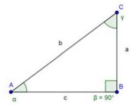
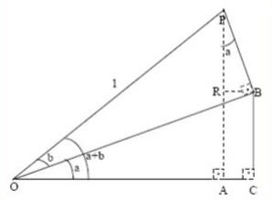
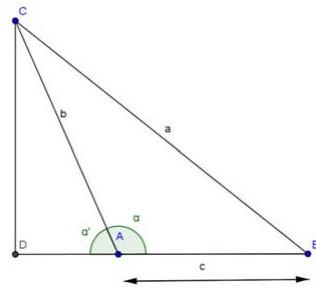
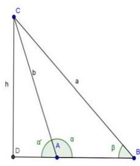
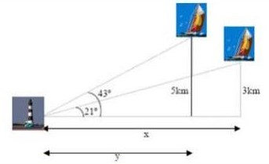
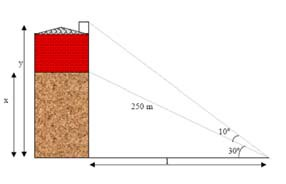
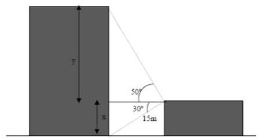

# Razones trigonométricas

1.  Expresa en radianes las siguientes medidas:
    $60^{\circ}$, $120^{\circ}$, $225^{\circ}$, $330^{\circ}$.

2.  Expresa en grados sexagesimales:
    $\frac{\pi}{4}, \frac{2 \pi}{3}, \frac{3 \pi}{2}$ y
    $\frac{10 \pi}{6}$ radianes.

3.  ¿Cuánto suman (en radianes) los ángulos de un triángulo? ¿Cuánto
    mide un ángulo recto en radianes?

4.  Para ver la utilidad de los radianes, supongamos un móvil que se
    mueve en una circunferencia de dos metros de radio con una velocidad
    de \qty{4}{m/s}. Calcula su velocidad en rad/s y en
    grados por segundo. ¿cuántas vueltas da por minuto?

5.  Un móvil ha recorrido 3 rad en una circunferencia de radio
    \qty{2}{m}$. ¿Cuánto espacio ha recorrido? ¿Y si la
    circunferencia tuviera de radio \qty{0.5}{m}?

6.  Hemos recorrido 40 grados de una circunferencia de radio
    \qty{2}{m}. ¿cuánto espacio hemos recorrido? ¿y si tuviera
    radio \qty{0.5}{m}? ¿Es más fácil o más dificil que hacerlo
    con radianes?

7.  En la figura se verifica el teorema de Pitágoras
    $a^{2}+b^{2}=c^{2}$. Utilizando dicho teorema, demuestra la primera
    relación fundamental.
    { width=50% }

8.  Utilizando las definiciones de las razones trigonométricas,
    demuestra la segunda relación fundamental.

9.  Utilizando la definición de las identidades, demuestra:

    a)  $1+\tg^{2}(\alpha)=\sec^{2}(\alpha)$

    b)  $1+\cotg^{2}(\alpha)=\cosec^{2}(\alpha)$

10. Comprueba las anteriores relaciones a partir de los ángulos de
    $30^{\circ}$ y $60^{\circ}$.

11. Explica por qué el seno y el coseno de $45^{\circ}$ son iguales, y
    por qué la tangente vale la unidad.

12. Copia en tu cuaderno, sitúa en el cuadrante que corresponda y
    expresa en función de un ángulo agudo las razones trigonométricas de
    los siguientes ángulos:

    Ángulo           Seno   Coseno   Tangente   Secante   Cosecante   Cotangente
    ---------------- ------ -------- ---------- --------- ----------- ------------
    $135^{\circ}$                                                     
    $120^{\circ}$                                                     
    $210^{\circ}$                                                     
    $315^{\circ}$                                                     
    $390^{\circ}$                                                     
    $3000^{\circ}$                                                    
    $-150^{\circ}$                                                    

13. Utiliza la calculadora para encontrar todos los ángulos positivos
    menores que $360^{\circ}$ cuyo seno es de $0.6$.

14. Ídem todos los ángulos negativos menores en valor absoluto que
    $360^{\circ}$ cuya tangente vale 4.

15. Idem todos los ángulos comprendidos entre $360^{\circ}$ y
    $720^{\circ}$ cuyo coseno vale $0.75$.

1.  Sabiendo que $\cos \alpha=\frac{\sqrt{5}}{3}$, halla las restantes
    razones trigonométricas del ángulo $\alpha$. (Hay dos soluciones).

2.  Calcula sin hacer uso de la calculadora las demás razones
    trigonométricas:

    a) $\sen(\alpha)=0.2 \text { (cuadrante II) }$
    b) $\cos (\alpha)=-0.3 \text { (cuadrante III) }$
    c) $\tg(\alpha)=2 \text { (cuadrante I) }$

3.  Sabiendo que $\sen \alpha=-\frac{4}{5}$, y que
    $\alpha$ es un ángulo del tercer cuadrante, halla el coseno y la
    tangente de dicho ángulo.

4.  Si $\tg x=1 / 3$, y x es un ángulo del primer
    cuadrante, calcula:
    
    a)  $\tg\left(180^{\circ}-x\right)$

    b)  $\sen\left(180^{\circ}+x\right)$
    
    c)  $\cos \left(360^{\circ}-x\right)$

5.  Sabiendo que $\sen \alpha=0.5$, y que $\alpha$ es un
    ángulo del II cuadrante, halla las otras cinco razones de dicho
    ángulo.

6.  Calcula a partir de las razones trigonométricas de
    $30^{\circ}, 45^{\circ}, 60^{\circ}$ y $90^{\circ}$ las razones
    trigonométricas de
    $75^{\circ}, 120^{\circ}, 150^{\circ}, 105^{\circ}$ y $135^{\circ}$

7.  Comprueba que las razones trigonométricas de $90^{\circ}$ se pueden
    obtener a partir de las razones trigonométricas de $30^{\circ}$ y de
    $60^{\circ}$.

8.  Calcula a partir de las razones trigonométricas de
    $30^{\circ}, 45^{\circ}, 60^{\circ}$ y $90^{\circ}$ las razones
    trigonométricas de $15^{\circ}$

9.  Comprueba que las razones trigonométricas de $30^{\circ}$ se pueden
    obtener a partir de las razones trigonométricas de $90^{\circ}$ y de
    $60^{\circ}$.

10. Demuestra las fórmulas de ángulos complementarios usando las
    fórmulas de la resta. Es decir, verifica que
    $\sen(90-\alpha)=\cos (\alpha)$ y las demás usando estas
    fórmulas. Observa que esta demostración es más general que la que
    hicimos antes, porque ahora $\alpha$ no tiene por qué ser agudo.

    { width=50% }

11. Calcula las razones trigonométricas de $22.5^{\circ}$ y
    $11.25^{\circ}$ a partir de las razones trigonométricas de
    $45^{\circ}$.

12. Comprueba que las razones trigonométricas de $45^{\circ}$ se pueden
    obtener a partir de las razones trigonométricas de $90^{\circ}$.

13. Calcula $\cos (3 a)$ en función únicamente de $\cos (a)$.

14. Calcula $\sen( 4 a )$ en función únicamente de
    $\sen(a)$ y $\cos (4 a)$ en función de $\cos (a)$.

15. Calcula sin hacer uso de la calculadora: 
    
    a)  $\sen (75)-\sen(15)$;
    b)  $\cos (15)-\sen(15)$
    
16. Utiliza las transformaciones de sumas en productos para poner
    en función del seno y coseno del ángulo a:

    a)  $\sen(45+a)+\sen(45-a)$; 
    b)  $\cos (120+a)+\cos (60+a)$;
    c)  $\cos (270-a)-\cos (90-a)$

17. Simplifica las siguientes expresiones hasta obtener una única razón
    trigonométrica:

    a)  $\frac{\sen(5 a)+\sen(3 a)}{\cos (5 a)+\cos (3 a)}$

    b)  $\frac{\cos (x-y)-\cos (x+y)}{\sen(x+y)+\sen(x-y)}$

# Ecuaciones y sistemas trigonométricos

1.  Calcula las soluciones de las siguientes ecuaciones trigonométricas

    a)  $\cos (3 x)=0$

    b)  $\tg(2 x)=-1$

    c)  $\sen(4 x)=-1$

30. Expresa en radianes las soluciones de la actividad resuelta
    $(\sen(2 x)=1 / 2)$ y de la actividad propuesta
    anterior.

31. Calcula las soluciones de las siguientes ecuaciones trigonométricas:

    a)  $\cos (5 x)-\cos (x)=0$

    b)  $\sen(2 x)-\sen(4 x)=0$

32. Calcula las soluciones de las siguientes ecuaciones trigonométricas:

    a)  $\sen(x)+\cos (x)=1$

    b)  $\sen(2 x)=2 \cdot \cos (x)$

    c)  $\sen^{2}(x)-\cos ^{2}(x)-\cos (2 x)=1$

33. Resuelve los siguientes sistemas:

    a)  $\left\{\begin{array}{l}x+\sen^{2} y=2 \\ x+\cos ^{2} y=1\end{array}\right.$

    b)  $\left\{\begin{array}{l}\sen(x) \cdot \cos (y)=\frac{3}{4} \\ \cos (x) \sen(y)=\frac{1}{4}\end{array}\right.$

34. Resuelve los siguientes sistemas: 
    
    a)  $\left\{\begin{array}{l}\sen(x)-\sen(y)=0 \\ x-y=\pi\end{array}\right.$

    b)  $\left\{\begin{array}{l}\sen(x) \cdot \cos (y)=\frac{1}{2} \\ x+y=\frac{\pi}{2}\end{array}\right.$

35. Resuelve los siguientes sistemas: 
     
    a)  $\left\{\begin{array}{l}\cos (x-y)=0 \\ \cos (x+y)=0\end{array}\right.$

    b)  $\left\{\begin{array}{l}\sen(x-y)=1 / 2 \\ \cos (x-y)=1 / 2\end{array}\right.$

1.  Resuelve: 
    a) $3 \sen^{2} x+\cos ^{2} x+\cos x=0$

    b) $\tg x=\sqrt{2} \cos x$

2.  Demuestra las siguientes identidades:

    a)  $(\tg x)(\cos x)=\sen(x)$

    b)  $\cot g^{2} x-1=\frac{\cos (2 x)}{\sen^{2} x}$

    c)  $\sec ^{2} x=1+\tg^{2} x$

    d)  $1+\cos (2 x)=\frac{2}{1+\tg^{2} x}$

    e)  $\cosec^{2} x=1+\cot^{2} x$

    f)  $\frac{\cos x+\sen x}{\cos x-\sen x} \cdot \cos 2 x=1+\sen 2 x$

9.  Demuestra que son ciertas las siguientes igualdades:

    a)  $\sen a \cdot \sen(a-b)+\cos a \cdot \cos (a-b)=\cos b$

    b)  $\tg 2 \alpha=\frac{2 \tg \alpha}{1-\tg^{2} \alpha}$

10. Resuelve las siguientes ecuaciones trigonométricas:

    a)  $\cos 2 \alpha-3 \sen \alpha+1=0$

    b)  $\sen \alpha+\cos \alpha=0$

11. Di si son ciertas o falsas las siguientes igualdades:

    a)  $\frac{1+\tg^{2} x}{1+\cot^{2} x}=\tg^{2} x$

    b)  $\frac{\sen(2 x)}{1+\cos (2 x)}=\tg(x)$

12. Demuestra que son ciertas las siguientes igualdades:

    a)  $\frac{2 \sen x}{\tg 2 x}=\cos x-\frac{\sen^{2} x}{\cos x}$

    b)  $\frac{1-\sen^{4} x}{\cos ^{2} x}=2-\cos ^{2} x$

13. Comprueba que son ciertas las siguientes igualdades:

    a)  $\frac{1+\tg^{2}(\alpha)}{1+\cot^{2}(\alpha)}=\tg^{2}(\alpha)$

    b)  $\frac{\cos ^{2}(\alpha)}{1+\sen(\alpha)}=1-\sen(\alpha)$

14. Comprueba que son ciertas las siguientes igualdades:

    a)  $\frac{1+\tg^{2}(\alpha)}{1+\cot^{2}(\alpha)}=\tg^{2}(\alpha)$

    b)  $\frac{\cos ^{2}(\alpha)}{1+\sen(\alpha)}=1-\sen(\alpha)$

14. Resuelve las siguientes ecuaciones trigonométricas:

    a)  $\cos x \cdot \cos 2 x+2 \cos ^{2} x=0$

    b)  $\tg x-\sen 2 x=0$

16. Demuestra que son ciertas las igualdades:

    a)  $\cos (\alpha-\beta)-(\sen \beta)(\tg \alpha)(\cos \alpha)=\frac{\cos \alpha}{\sec \beta}$

    b)  $\sen(270-\alpha)+\cos (\alpha)=0$

17. Resuelve la ecuación trigonométrica
    $\cos (2 \alpha)+1=4 \cos \alpha$, dando **todas** las soluciones
    posibles).

18. Resuelve la ecuación trigonométrica
    $\frac{\sen(2 x)}{\tg x}+\cos ^{2} x=1$,
    dando **todas** las soluciones posibles.

19. Resuelve la ecuación trigonométrica
    $\cos (2 x)+\cos (x)=0,2$, dando **todas** las
    soluciones posibles.

20. Resuelve las siguientes ecuaciones

    a)  $\sen^{2}(x)-\sen(x)=0$

    b)  $\cos (x)+\sen^{2}(x)=1$;

    c)  $3 \tg^{2}(x)=\sec ^{2}(x)$

    d)  $\sen(2 x)=0.5$

21. Resuelve los siguientes sistemas:

    a)  $\left\{\begin{array}{l}x+\sen^{2} y=2 \\ x+\cos ^{2} y=1\end{array}\right.$

    b)  $\left\{\begin{array}{l} \sen(x) \cdot \cos (y)= 3/4 \\ \cos (x) \cdot \sen(y)=1/4\end{array}\right.$

    c)  $\left\{\begin{array}{l}\cos (x)+\cos (y)=1 \\ \cos (x+y)=1\end{array}\right.$

22. Resuelve las siguientes ecuaciones: 

    a)  $\sen\left(\frac{\pi}{4}+2 x\right)=\frac{\sqrt{3}}{2}$,

    b)  $\sen(3 x)-\sen\left(30^{\circ}\right)=0$,

    c)  $\sen(2 x)=2 \cdot \cos (x)$

23. Simplifica las siguientes expresiones:

    a)  $(\sen(x)+\cos (x))^2 + (\sen(x)-\cos (x))^2$

    b)  $\frac{\sen(2 a) \cdot \cos (a)}{\sen(a) \cdot(1+\cos 2 a)}$

    c)  $\frac{\sen^{3}(x)+\sen(x) \cdot \cos ^{2}(x)}{\sen(x)}$

    d)  $\frac{\tg(a)}{\tg(2 a)-\tg(a)}$

    e)  $\frac{\sen(x-y)-\sen(x+y)}{\cos (x+y)-\cos (x-y)}$

1.  Resuelve las siguientes ecuaciones trigonométricas
    i.  $\sen 2x = \cos \ang{60}$

    i.  $\tg 2x = - \tg  x$

    i.  $\sen^2 2x - \cos^2 x = \frac{1}{2}$
    
    i.  $\sen x = \sen(\ang{45} - x)$
    
    i.  $\sen(x + \ang{45}) = \frac{\sqrt{3}}{2}$
    
    i.  $\sen x + \sqrt{3} \cos x = 2$
    
    i.  $\tg x \cdot \sec x = \sqrt{2}$
    
    i.  $\frac{\sen^2 x}{2}= \frac{\tg x}{4}$
    
    i.  $4\tg x = \frac{\sqrt{3}}{\cos^2 x}$
    
    i.  $\tg(x - \ang{45}) + \tg(x + \ang{45}) = 2\cot x$
    
    i.  $\cos x \cdot \cos 2x + 2\cos^2 x = 0$
    
    i.  $\cos 2x + \sen x = 4\sen^2 x$
    
    i.  $2\tg x - 3\cot x - 1 = 0$ 
    
    i.  $\sen 2x \cdot \cos x = 6\sen^3 x$ 
    
    i.  $\cos x = \frac{2\tg x}{1 + \tg^2 x}$
    
    i.  $3\cos x = 2\sec x - 5$
    
    i.  $\frac{\sen(x + \ang{30})}{\cos(x + \ang6{0})} = 1$
    
    i.  $4\sen \frac{x}{2} + 2\cos x = 3$
    
    i.  $4\sen(x - \ang{30}) \cos(x - \ang{30}) = \sqrt{3}$
    
    i.  $\tg \frac{x}{2} = \frac{\tg x - 2}{\tg x + 2}$
    
    i.  $3\sen 2x - 5\sen x + 2 = 0$
    
    i.  $\cos 2x = 5 - 6\cos^2 x$
    
    i.  $\cos 2x + 5\cos x + 3 = 0$
    
    i.  $\frac{\cos x}{\tg x} = \frac{3}{2}$
    
    i.  $\sen 6x + \sen 2x = 2\sen 4x$
    
    i.  $\cos 2x + \cos x = \sen x + \sen 2x$
    
    i.  $\cos 2x - \cos 6x = \sen 5x + \sen 3x$
    
    i.  $\cos 8x + \cos 6x = 2\cos \ang{210} \cdot \cos x$
    
    i.  $4\sen(x - \ang{30}) \cdot \cos (x - \ang{30}) = \sqrt{3}$
    
    i.  $\cos 4x + \cos 2x = \sen 4x - \sen 2x$

    {S}

    i. $x_{1}=\frac{\pi}{12}+k \pi ; x_{2}=\frac{5 \pi}{12}+k \pi$

    i. $x_{1}=k \pi$; $x_{2}=\frac{\pi}{3}+k \pi$, $x_{3}=\frac{2 \pi}{3}+k \pi$ 

    i. $x_{1}=\frac{\pi}{3}+k \pi$; $x_{2}=\frac{2 \pi}{3}+k \pi$ 

    i. $x=\frac{\pi}{8}+k \pi$

    i. $x_{1}=\frac{\pi}{12}+2 k \pi$; $x_{2}=\frac{5 \pi}{12}+2 k \pi$ 

    i. $x=\frac{\pi}{6}+2 k \pi$

    i. $x_{1}=\frac{\pi}{4}+2 k \pi$; $x_{2}=\frac{3 \pi}{4}+2 k \pi$ 

    i. $x=k \pi$; $x_{2}=\frac{\pi}{4}+k \pi$

    i. $x_{1}=\frac{\pi}{3}+k \pi$; $x_{2}=\frac{\pi}{6}+k \pi$

    i. $x_{1}=\frac{\pi}{2}+k \pi$; $x_{2}=\frac{\pi}{6}+k \pi$; $x_{3}=\frac{5 \pi}{6}+k \pi$ 

    i. $x_{1}=\frac{\pi}{2}+k \pi$; $x_{2}=\ang{68;31;45.47}+360 k$; $x_{3}=\ang{291;29;45.47}+360 k$

    i. $x_{1}=\frac{\pi}{6}+2 k \pi$; $x_{2}=\frac{5 \pi}{6}+2 k \pi$; $x_{3}=\ang{340;31;43,61}+360 k$; $x_{4}=\ang{199;28;14,53}+360 k$

    i. $x_{1}=\frac{3 \pi}{4}+k \pi$; $x_{2}=\ang{56;18;35,76}+180 k$ 

    i. $x_{1}=k \pi$; $x_{2}=\frac{\pi}{6}+k \pi$; $x_{3}=\frac{5 \pi}{6}+k \pi$ 

    i. $x_{1}=\frac{\pi}{6}+2 k \pi$; $x_{2}=\frac{5 \pi}{6}+2 k \pi$

    i. $\left\{\begin{array}{l}x_{1}=\ang{70;31;43,61}+360 k \\ x_{2}=\ang{289;28;16,39}+360 k\end{array}\right.$ 

    i. $x=k \pi$

    i. $\left\{\begin{array}{l}x_{1}=\frac{\pi}{3}+2 k \pi \\ x_{2}=\frac{5 \pi}{3}+2 k \pi\end{array}\right.$
    
    i. $\left\{\begin{array}{l}x_{1}=\frac{\pi}{3}+k \pi \\ x_{2}=\frac{\pi}{2}+k \pi\end{array}\right.$

    i. No tiene solución

    i. $x_{1}=\frac{\pi}{2}+2 k \pi ;\left\{\begin{array}{l}x_{2}=\ang{41;48;37,13}+360 k \\ x_{3}=\ang{138;11;22,87}+360 k\end{array}\right.$

    i. $x_{1}=\frac{\pi}{6}+k \pi$; $x_{2}=\frac{5 \pi}{6}+k \pi$
    
    i. $x_{1}=\frac{2 \pi}{3}+2 k \pi$; $x_{2}=\frac{4 \pi}{3}+2 k \pi$

    i. $x=\frac{\pi}{6}+k \pi$

    i. $x=\frac{k \pi}{4}$

    i. $x_{1}=(2 k-1)\frac{\pi}{4}$; $x_{2}=\pi+2 k \pi$
    
    i. $x_{1}=\frac{k \pi}{4}$; $x_{2}=\frac{\pi}{6}+2 k \pi$; $x_{3}=\frac{5 \pi}{6}+2 k \pi$

    i.  $x=\frac{\pi}{2}+k \pi$ 

    i.  $x_{1}=\frac{\pi}{3}+k \pi$; $x_{2}=\frac{\pi}{2}+k \pi$

    i.  $x_{1}=\frac{\pi}{6}+\frac{k \pi}{3}$; $x_{2}=(2 k-1)\frac{\pi}{4}$

# Resolución general de triángulos

2.  Demuestra que el teorema del coseno también vale para ángulos entre
    90 y 180 grados. Para ello, procede como sigue:

    { width=50% }

    a)  En la figura, considera el ángulo $a'$. Se
        cumple que $\cos \left(\alpha^{\prime}\right)=-\cos (\alpha)$, ¿por qué?
        
    b)  Considera el triángulo rectángulo $D B C$ y pon $a$ en función de
        $C D$ y $D B$.

    c)  De la misma manera que antes, pon $C D$ y $D B$ en función de $b$, $c$
        y $a'$.

    d)  Sustituye en la expresión para $a$ hasta llegar a una fórmula para
        $a$ en función de $b$, $c$ y $a'$. Al sustituir el
        $\cos \left(\alpha^{\prime}\right)=-\cos (\alpha)$ tienes el resultado.

3.  Dibuja un triángulo con $b=5$, $c=8$ y el ángulo entre ellos
    $\alpha=40^{\circ}$ (usa una regla y un transportador). Calcula el
    otro lado con el teorema del coseno y comprueba que coincide con el
    resultado medido. No te saldrá exactamente por el redondeo y el
    error de medida, pero debería ser muy similar.

4.  Un triángulo tiene de lados 3, 5 y 7. Calcula sus ángulos.

5.  En un triángulo $A B C$, los lados $A B$ y $A C$ miden 3 y
    \qty{2}{cm}$ respectivamente. El ángulo $\beta$ correspondiente
    al vértice $B$ mide 30 grados.

    a)  Utiliza el teorema del coseno para calcular el otro lado. Obtendrás
        dos soluciones.

    b)  Las dos soluciones se deben a que hay dos triángulos ¿serías capaz
        de dibujarlos?

6.  ¿Qué ocurre cuando la altura cae **fuera** del segmento $A B$? En otras
    palabras, si tenemos la figura que ves más abajo. Demuestra el
    teorema del seno en ese caso (***Pista***: hay que utilizar $a'$ en vez de
    a y ver la relación entre el seno de ambos ángulos)

    { width=50% }

7.  El ejercicio anterior ya demuestra que el teorema del seno vale para
    triángulos obtusángulos ¿por qué? Demuestra el teorema para un
    triángulo rectángulo usando que $\sen 90=1$

42. Como antes, dibuja un triángulo con $b=5$, $c=8$ y el ángulo entre ellos
    $\alpha=40^{\circ}$.
    Calcula con el teorema del seno el ángulo opuesto al lado $b$ y calcula,
    **sin utilizar el teorema del coseno** el otro ángulo y el lado que falta.
    Comprueba que te sale lo mismo que si hubieras utilizado el teorema del
    coseno para calcular $a$.

1.  Un triángulo dos ángulos que valen 40 y 60 grados respectivamente.
    El lado entre ellos es de \qty{8}{cm}. Calcula todos sus
    ángulos y lados.

2.  Un globo está en la vertical entre dos observadores separados por
    \qty{40}{m}. El primero lo ve con un ángulo de 30 grados y el
    segundo con un ángulo de 50 grados, ¿a qué altura está el globo?

3.  En un viaje de alumnos de $4^{\circ}$ de E.S.O. a Londres, algunos
    de los viajeros hicieron prácticas de trigonometría. Al conocer que
    las torres de la Abadia de Westminster tienen 30 metros de altura,
    decidieron aprovechar sus conocimientos para calcular la altura de
    la conocida torre Big Ben. Desde un punto intermedio entre ambos
    edificios se divisa el punto más alto de la Abadía con ángulo de
    $60^{\circ}$, y el Big Ben con un ángulo de $45^{\circ}$. Si la
    distancia entre las bases de las torres de los dos edificios es de
    50 metros, ¿cuál fue el resultado de sus cálculos?, ¿a qué distancia
    se encontraba de cada edificio?

4.  Una antena de radio está sujeta al suelo con dos cables, que forman
    con la antena ángulos de $36^{\circ}$ y $48^{\circ}$. Los puntos de
    sujeción de los cables están alineados con el pie de la antena y
    distan entre si 98 metros. Calcula la altura de la antena.

5.  Calcula los lados y los ángulos del triángulo $A B C$, rectángulo en
    $A$, del que conocemos el cateto $A C= \qty{15}{cm}$. y la altura
    relativa a la hipotenusa $A D= \qty{12}{cm}$.

6.  Calcular el área de un heptágono regular inscrito en una
    circunferencia de \qty{35}{cm} de perimetro. Calcular el radio
    de la circunferencia inscrita.

7.  En un tramo de carretera la inclinación es del 5% (sube
    \qty{5}{m} en \qty{100}{m}). Calcular el ángulo que forma
    con la horizontal la carretera. Sabemos que hemos subido
    \qty{100}{m}, ¿Cuánto hemos andado por la carretera?

8.  Desde un cierto punto del suelo se ve un árbol bajo un ángulo de
    $42^{\circ}$ ¿bajo qué ángulo se ve colocándose al doble de
    distancia?

9.  En un triángulo conocemos dos de sus ángulos y un lado:
    $A=55^{\circ}, B=98^{\circ}, a=\qty{7.5}{\cm}$. Resuélvelo.

10. En un triángulo conocemos dos lados y el ángulo comprendido entre
    ellos $A=35^{\circ}, b=\qty{20}{\cm}, c=\qty{14}{\cm}$.
    Resuélvelo.

11. Halla los ángulos de un triángulo del que se conocen los tres lados:
    $a=\qty{37}{\cm}, b=\qty{42}{\cm}, c=\qty{68}{\cm}$.

12. Dos barcos parten de un puerto con rumbos distintos que forman un
    ángulo de $127^{\circ}$. El primero sale a las 10 h de
    la mañana con una velocidad de 17 nudos, y el segundo sale a las 11
    h 30 min, con una velocidad de 26 nudos. Si e alcance de sus equipos
    de radio es de \qty{150}{km}. ¿Podrán ponerse en contacto a las
    3 de la tarde? (nudo = milla/hora; milla = \qty{1850}{\m}).

13. Dos amigos están en una playa a \qty{150}{\m} de distancia y en
    el mismo plano vertical que una cometa que se encuentra volando
    entre ambos. En un momento dado, uno la ve con un ángulo de
    elevación de $50^{\circ}$ y el otro con un ángulo de $38^{\circ}$,
    ¿Qué distancia hay desde cada uno de ellos a la cometa?

14. Un globo aerostático se encuentra sujeto al suelo, mediante dos
    cables de acero, en dos puntos que distan 70 metros. El cable más
    corto mide 90 metros y el ángulo que forma el otro cable con el
    suelo es de $42^{\circ}$. Calcula:

    a)  La medida del otro cable.

    b)  La distancia del globo al suelo.

15. Desde un faro $F$ se ve un barco $A$ con ángulo de $43^{\circ}$ con
    la costa, y el barco $B$ con $21^{\circ}$. El barco $B$ está a
    \qty{3}{\km} de la costa y el $A$ a \qty{5}{\km}. Calcula
    distancia entre los barcos.

    { width=80% }

16. Una finca tiene forma triangular. Dos de sus lados miden
    \qty{140}{\m} y \qty{200}{\m}
    respectivamente, y el ángulo comprendido entre ambos es de $35^{\circ}$.
    Calcula el perimetro y la superficie de la finca.

17. Calcula el área y el perimetro de un pentágono regular inscrito en
    una circunferencia de radio \qty{3}{cm}.

18. Calcula la altura del edificio:

    { width=80% }

19. Dos personas $A$ y $B$ distan entre si \qty{200}{m} y ven un
    globo que está situado entre ambas. La primera persona lo ve con un
    ángulo de $30^{\circ}$ y la segunda con un ángulo de $60^{\circ}$.

    a)  ¿A qué distancia está $B$ del globo?

    b)  ¿A qué altura está el globo?

    c)  Una persona que esté situada dentro del globo ¿Con qué ángulo ve a
        $A$ y $B$?

20. Calcula la altura de la torre grande a partir del siguiente dibujo.
    
    { width=80% }

21. Deseamos medir la altura de un edificio. Si lo observamos desde un
    punto $A$ lo vemos con un ángulo de $50^{\circ}$. Ahora bien, si lo
    contemplamos desde \qty{20}{m} más lejos el ángulo es de
    $40^{\circ}$. ¿Cuál es la altura del edificio? ¿A qué distancia está
    el punto $B$ de dicho edificio?

22. Calcula todos los ángulos de un triángulo de lados 4, 5 y 6. ¿Hay
    más de una solución? Si hay más de una, calcúlalas todas, si hay una
    sola, explica por qué.

23. Justifica que hay ***exactamente*** **DOS** triángulos con lados
    $a=4$, $b=5$ y ángulo $\alpha$ (el opuesto al lado a)
    igual a $45^{\circ}$.

24. Resuelve los siguientes triángulos:

    a)  $\alpha=45^{\circ}$, $b=\qty{50}{\m}$, $a=\qty{40}{\m}$

    b)  $\beta=30^{\circ}$, $a=\qty{5}{\cm}$, $b=\qty{3}{\cm}$
    
    c)  $\alpha=45^{\circ}$, $\gamma=60^{\circ}$, $b=\qty{20}{\m}$
    
    d)  $\gamma=45^{\circ}$, $b=\qty{10}{\m}$, $c=\qty{6}{\m}$;

    e)  $a=\qty{5}{\cm}$, $b=\qty{4}{\cm}$, $c=\qty{4}{\cm}$

25. Comenzamos en una ciudad $A$ y observamos un cartel. La ciudad $B$
    está a $\qty{50}{\km}$ y la ciudad $C$ a $\qty{40}{\km}$. Medimos
    el ángulo que forman las dos carreteras y resulta ser de
    $60^{\circ}$. ¿A qué distancia está $B$ de $C$? Desde la ciudad $B$
    ¿Con qué ángulo se ven las otras dos ciudades? (En otras palabras:
    si consideramos el triángulo $A B C$, ¿cuánto vale el ángulo $\beta$
    que corresponde al vértice $B$?)