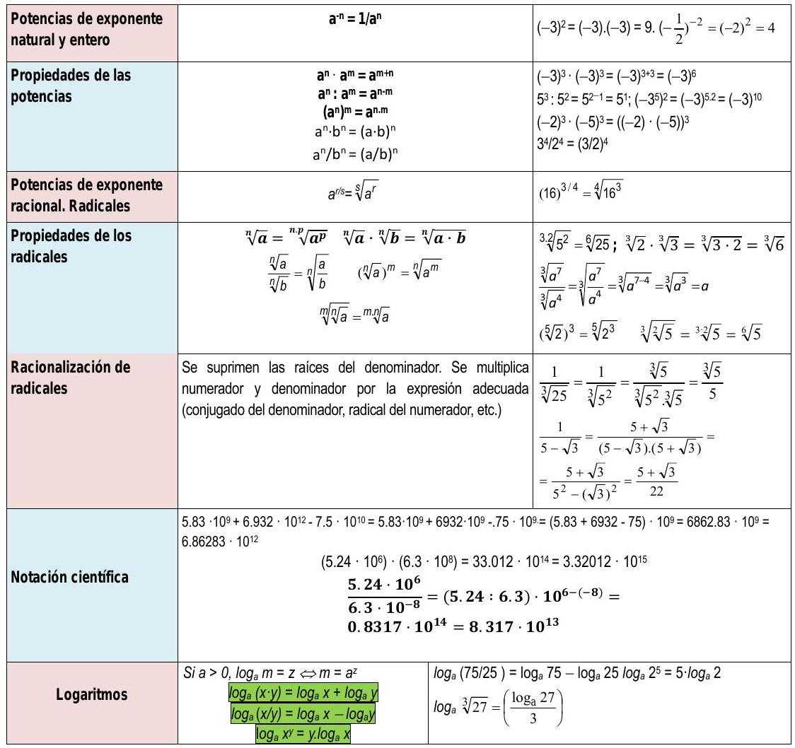

# Potencias y raíces

## Actividades propuestas

### Potencias

1.  Calcula las siguientes potencias:

    a)  $-x^{3}$

    b)  $(x+1)^{3}$

    c)  $-(-2 x)^{2}$

1.  Efectúa las siguientes operaciones con potencias:

    a)  $(x+1) \cdot (x+1)^{3}$

    b)  $(x+2)^{3}:(x+2)^{4}$

    c)  $\left[(x-1)^{33}\right]^{4}$

    d)  $(x+2) \cdot(x+1)^{-3}$

### Potencias y radicales

1.  Calcula:

    a)  $\left(\sqrt[3]{a^{6} \cdot b^{9}}\right)^{2}$

    b)  $\sqrt[3]{\frac{2}{3}} \cdot \sqrt[3]{\frac{3}{4}}$

    c)  $\left(\sqrt[12]{(x+1)^{3}}\right)^{2}$

5.  Hallar

    a)  $\sqrt[2]{\sqrt[4]{\frac{x}{5 y}}}: \sqrt{\sqrt[4]{\frac{3 x}{y^{2}}}}$

    b)  $\sqrt{\frac{5}{3}}: \sqrt{\frac{2}{3}}$

6.  Realiza las siguientes operaciones con radicales:

    a)  $\sqrt[4]{\frac{x}{5 y}}: \sqrt[4]{\frac{3 x}{y^{2}}}$

    b)  $\left(\sqrt[5]{(x+3)^{2}}\right)^{3}$

### Operaciones con radicales. Racionalización

1.  Escribe bajo un solo radical y simplifica:
    $\sqrt[2]{2 \cdot \sqrt[2]{3 \cdot \sqrt[2]{4 \cdot \sqrt[2]{5 \cdot \sqrt[2]{6 \sqrt[2]{8}}}}}}$

2.  Calcula y simplifica:
    $\frac{\sqrt[4]{x^{3} \cdot y^{3}} \cdot \sqrt[3]{x^{4} \cdot y^{5}}}{\sqrt[6]{x^{5} \cdot y^{4}}}$

3.  Realiza la siguiente operación:
    $\sqrt{x^{3}}+\sqrt{16 x^{7}}+\sqrt{x}$

4.  Calcula y simplifica:
    $\sqrt[2]{\frac{3}{x}} \cdot \sqrt[3]{\frac{x^{2}}{8}} \cdot \sqrt[4]{\frac{9}{5}}$

5.  Racionaliza la expresión: $\frac{x+3 y}{\sqrt{x}-\sqrt{2 y}}$

6.  Racionaliza: $\frac{3 \sqrt{3}+2 \sqrt{2}}{\sqrt{3}+\sqrt{2}}$

7.  Racionaliza: $\frac{5 \sqrt{5}-2 \sqrt{2}}{\sqrt{5}-2}$

### Notación científica

1.  Calcula:

    a)  $\left(7.83 \cdot 10^{-5}\right) \cdot\left(1.84 \cdot 10^{13}\right)$

    b)  $\left(5.2 \cdot 10^{-4}\right):\left(3.2 \cdot 10^{-6}\right)$

2.  Efectúa y expresa el resultado en notación cientifica:

    a)  $\frac{3.10^{-5}+7.10^{-4}}{10^{6}-5.10^{5}}$

    b)  $\frac{7.35 .10^{4}}{5.10^{-3}}+3.2 \cdot 10^{7}$

3.  Realiza las siguientes operaciones y efectúa el resultado en
    notación cientifica:

    a)  $\left(4.3 \cdot 10^{3}-7.2 \cdot 10^{5}\right)^{2}$

    b)  $\left(7.8 \cdot 10^{-7}\right)^{3}$

### Logaritmos

1.  Empareja cada logaritmo con su potencia:

    --------------  ------------------  ------------------  ------------------
     $2^{5}=32$      $\log _{5} 1=0$     $2^{0}=1$           $5^{2}=25$
     $5^{1}=5$       $\log _{2} 2=1$     $5^{0}=1$           $\log _{2} 32=5$
     $2^{1}=2$       $\log _{2} 1=0$     $\log _{5} 5=1$     $\log _{5} 25=2$
     $2^{4}=16$      $\log _{3} 81=4$    $\log _{2} 16=4$    $3^{4}=81$
    --------------  ------------------  ------------------  ------------------

2.  Calcula utilizando la definición de logaritmo:

    a) $\log _{2} 2^{5}$
    b) $\log _{5} 25$
    c) $\log _{2} 2^{41}$
    d) $\log _{5} 5^{30}$

3.  Calcula utilizando la definición de logaritmo:
    a) $\log _{3} 27$ 
    b) $\log _{10} 100$
    c) $\log _{1 / 2}(1 / 4)$
    d) $\log _{10} 0.0001$

4.  Calcula $x$ utilizando la definición de logaritmo:
    a) $\log _{2} 64=x$
    b) $\log _{1 / 2} x=4$
    c) $\log _{x} 25=2$

5.  Calcula utilizando la definición de logaritmo:

    a)  $\log _{2} 64+\log _{2} 1 / 4-\log _{3} 9-\log _{2} \sqrt{2}$

    b)  $\log _{2} 1 / 32+\log _{3} 1 / 27-\log _{2} 1$

6.  Desarrolla las expresiones que se indican:

    $$\begin{array}{ll}
    \text { a) } \ln \sqrt[5]{\frac{4 x^{2}}{e^{3}}} & \text { b) } \log \left(\frac{a^{3} \cdot b^{2}}{c^{4} \cdot d}\right)
    \end{array}$$

7.  Expresa los logaritmos de los números siguientes en función de
    $\log 3=0.4771212$

    a)  81

    b)  27

    c)  59049

8.  Simplifica la siguiente expresión:

    $$\frac{1}{2} \log m-2 \log t-\log p+\frac{5}{2} \log h$$

## Ejercicios y problemas

### Potencias

1.  Expresa en forma exponencial:

    a)  $\frac{1}{64}$

    b)  $\frac{t}{t^{5}} \quad$ c) $\left(\frac{1}{z+1}\right)^{2}$

    d)  $\frac{27^{-2}}{81^{-5}}$

    e)  $\frac{x^{-2} \cdot y^{-7}}{x^{8} \cdot y^{-4}}$

3.  Calcula:

    a)  $4^{\frac{1}{2}}$

    b)  $125^{\frac{1}{3}}$

    c)  $625^{\frac{5}{6}}$

    d)  $\left(64^{\frac{2}{3}}\right)^{\frac{5}{6}}$

    e)  $\left(8^{\frac{-4}{3}}\right)^{\frac{2}{5}}$

### Radicales

1.  Expresar en forma de radical:

    a) $x^{\frac{7}{9}}$

    b) $\left(m^{5} \cdot n^{3}\right)^{\frac{1}{3}}$

    c) $\left[\left(x^{2}\right)^{\frac{1}{3}}\right]^{\frac{1}{5}}$

    d) $a^{\frac{1}{2}} \cdot b^{\frac{1}{3}}$

2.  Expresar en forma exponencial:

    a)  $\left(\sqrt[3]{x^{2}}\right)^{5}$

    b)  $\sqrt{\frac{a^{13}}{a^{6}}}$

    c)  $\sqrt[n]{\sqrt[m]{a^{k}}}$

    d)  $\sqrt[3]{x^{(5 x+1)}}$

    e)  $\sqrt[4]{\left(x^{2}\right)^{(3 x+2)}}$
    
    f) $\sqrt[3]{\sqrt[4]{\sqrt[2]{\left(x^{2}\right)^{\frac{1}{5}}}}}$

6.  Expresa como potencia única:

    a)  $\frac{\sqrt[3]{a^{8}}}{a^{2}}$

    b)  $\frac{\sqrt{125}}{\sqrt[3]{25}}$

    c)  $\frac{\sqrt[3]{a^{2}}}{a \cdot \sqrt{a}}$

    d) $2 \cdot \sqrt[3]{\frac{1}{4}}$

    e) $a \cdot \sqrt{\frac{1}{a}}$
    
    f) $\frac{1}{2} \cdot \sqrt{2} \cdot \sqrt[4]{2}$

    g)  $\frac{\sqrt[3]{a^{2}}}{a^{3}} \cdot \frac{a^{3}}{\sqrt{a}}$

### Propiedades de los radicales

1.  Simplifica:

    a)  $\sqrt[9]{64}$

    b)  $\frac{\sqrt[5]{16}}{\sqrt{2}}$

    c)  $\frac{\sqrt[4]{a^{3} \cdot b^{5} \cdot c}}{\sqrt{a \cdot b^{3} \cdot c^{3}}}$

    d)  $\sqrt[3]{\sqrt[4]{x^{5} \cdot x^{7}}}$
    
    e)  $\left(\sqrt{\sqrt{\sqrt{2}}}\right)^{8}$

    f)  $\frac{\sqrt[4]{x^{3} \cdot y^{3} \cdot \sqrt[3]{x^{4} \cdot y^{5}}}}{\sqrt[6]{x^{5} \cdot y^{4}}}$

    g)  $\sqrt[5]{x^{2} \cdot 3 \cdot \sqrt[10]{x^{2} \cdot \sqrt{x^{3}}}}$

2.  Extraer factores del radical:

    a)  $\sqrt[3]{32 x^{4}}$

    b)  $\sqrt[3]{81 a^{3} b^{5} c}$

    c)  $\left(\sqrt{\sqrt{2}}\right)^{10}$

    d)  $4 \sqrt{\frac{25 a^{2} b}{c^{6}}}$

    d)  $\sqrt{\frac{8 a^{5}}{b^{4}}}$
    
    e)  $\sqrt{\frac{28 x^{5}}{75 y^{3}}}$
    
    f)  $\sqrt{\frac{32 a^{3}}{45 b^{4}}}$

3.  Introducir factores en el radical:

    a) $2 \sqrt{\frac{3}{2}}$ 
    
    b) $3 \sqrt{\frac{2}{3}}$

    c) $2 \sqrt[3]{\frac{1}{4}}$
    
    d) $2 \cdot \sqrt[4]{\frac{5}{12}}$
    
    e) $\frac{1}{2} \cdot \sqrt{12}$
    
    f) $\frac{2}{3} \sqrt[3]{\frac{9}{4}}$

### Operaciones con radicales

1.  Resuelve:
   
    a)  $\sqrt[3]{a} \cdot \sqrt[3]{a^{2}} \cdot \sqrt[3]{b^{4}} \cdot \sqrt[3]{b^{2}}$
    
    b) $\sqrt{5 a} \cdot \sqrt{10 ab} \cdot \sqrt{8 a^{3} b} \cdot \sqrt{a}$
    
    c) $\frac{\sqrt[6]{20}}{\sqrt[4]{10}}$
    
    d) $\sqrt[4]{\frac{5}{12}}: \sqrt[4]{\frac{20}{3}}$
    
    e) $\sqrt{\frac{3}{2}}: \sqrt{\frac{2}{3}}$
    
    f) $\frac{\sqrt[3]{4}}{\sqrt{2}}$
    
2.  Efectúa:

    a)  $\sqrt{18}+\sqrt{50}-\sqrt{2}-\sqrt{8}$

    b)  $\sqrt{50 a}-\sqrt{18 a}$ c) $\sqrt{320}+\sqrt{80}-\sqrt{500}$

    d)  $\sqrt{\frac{7}{64}}+\sqrt{\frac{7}{4}}$

    e)  $5 \sqrt{96}-\sqrt[5]{\frac{3}{32}}$

    f)  $\sqrt[3]{\frac{135}{8}}-\sqrt[3]{\frac{5}{8}}$

    g)  $\sqrt{150}+\sqrt{54}-\sqrt{24}$

### Racionalización

1.  Racionaliza los denominadores

    a)  $\frac{5}{\sqrt[3]{2}}$
    
    b)  $\frac{3}{2-\sqrt{3}}$

    c)  $\frac{4}{\sqrt{3}+\sqrt{2}}$

    d)  $\frac{6}{\sqrt{3}-\sqrt{2}}$

    e)  $\frac{\sqrt{3}}{\sqrt{2}+\sqrt{3}}$
    
    f)  $\frac{\sqrt{5}-\sqrt{3}}{\sqrt{5}+\sqrt{3}}$

13. Racionaliza y simplifica:

    a)  $\frac{11}{2 \cdot \sqrt{5}+3}$
    
    b) $\frac{\sqrt{2}}{2\sqrt{2}+3}$

    c)  $\frac{\sqrt{3}+2 \cdot \sqrt{5}}{\sqrt{6}-\sqrt{5}}$
    
    d) $\frac{\sqrt{3}+2 \sqrt{2}}{\sqrt{3}-2 \sqrt{2}}$

    e)  $\frac{4 \sqrt{15}-2 \sqrt{21}}{2 \sqrt{5}-\sqrt{7}}$

    f) $\frac{1}{x+\sqrt{x^{2}-1}}$

14. Efectúa y simplifica:

    a)  $\left(\frac{\sqrt{6}-\sqrt{3}}{\sqrt{6}+\sqrt{3}}\right)\left(3+2 \sqrt{2}\right)$

    b)  $\frac{\left(\sqrt{5}+1\right)^{2}}{\sqrt{5}-1}-3 \sqrt{5}$

    c)  $\left(1-\frac{\sqrt{3}}{1+\sqrt{3}}\right):\left(1+\frac{\sqrt{3}}{1-\sqrt{3}}\right)$

### Notación científica

1.  La masa del Sol es 330000 veces la de la Tierra, aproximadamente, y
    esta es $5,98 \cdot 10^{21}$ t. Expresa en notación cientifica la
    masa del Sol, en kilogramos.

2.  El ser vivo más pequeño es un virus que pesa del orden de
    $10^{-18} \mathrm{~g}$ y el más grande es la ballena azul, que pesa,
    aproximadamente, $138 \mathrm{~t}$. ¿Cuántos virus serian necesarios
    para conseguir el peso de la ballena?

3.  Los cinco paises más contaminantes del mundo (Estados Unidos, China,
    Rusia, Japón y Alemania) emitieron 12 billones de toneladas de
    CO2 en el año 1995, cantidad que representa el 53.5%
    de las emisiones de todo el mundo. ¿Qué de CO2 se
    emitió en el año 1995 en todo el mundo?

4.  Expresa en notación científica:

    a)  Recaudación de las quinielas en una jornada de la liga de fútbol:
        1628000 €.

    b)  Toneladas de CO2 que se emitieron a la atmósfera en
        1995 en Estados Unidos 5228,5 miles de millones.

    c)  Radio del átomo de oxigeno: $0.000000000066 \mathrm{~m}$.

5.  Efectúa y expresa el resultado en notación cientifica:

    a)  $\left(3 \cdot 10^{-7}\right) \cdot\left(8 \cdot 10^{18}\right)$
    
    b)  $\left(4 \cdot 10^{-12}\right) \cdot\left(5 \cdot 10^{-3}\right)$
    
    c)  $\left(5 \cdot 10^{12}\right):\left(2 \cdot 10^{-3}\right)$
    
    d)  $3.1 \cdot 10^{12}+2 \cdot 10^{10}$
    
    e)  $\left(4 \cdot 10^{5}\right)^{-2}$

6.  Expresa en notación cientifica y calcula:

    a)  $(75800)^{4}:(12000)^{4}$

    b)  $\frac{0.000541 \cdot 10318000}{1520000 \cdot 0.00302}$

    c)  $(0.0073)^{2} \cdot(0.0003)^{2}$

    d)  $\frac{2700000-13000000}{0.00003-0.00015}$

7.  Efectúa y expresa el resultado en notación cientifica:

    a)  $\frac{3 \cdot 10^{-5}+7 \cdot 10^{-4}}{10^{6}-5 \cdot 10^{5}}$

    b)  $\frac{7.35 \cdot 10^{4}}{5 \cdot 10^{-3}}+3.2 \cdot 10^{7}$
    
    c)  $\left(4.3 \cdot 10^{3}-7.2 \cdot 10^{5}\right)$

## Autoevaluación

1.  El número $8^{-3/4}$ vale:

    a)  Un dieciseisavo

    b)  Dos

    c)  Un cuarto

    d)  Un medio

3.  Expresa como potencia de base 2 cada uno de los números que van
    entre paréntesis y efectúa después la operación:
    $$\left(16^{1 / 4}\right) \cdot \left(\sqrt[6]{4}\right) \cdot \left(\frac{1}{8}\right)$$
    El resultado es:

    a)  $2^{-1 / 3}$

    b)  $2^{-5 / 4}$

    c)  $2^{-5 / 3}$

    d)  $2^{-5}$

4.  El número: $\sqrt[3]{4 \sqrt[3]{6 \sqrt{8}}}$ es igual a:

    a)  $6^{1 / 4}$

    b)  $2^{1 / 3}$

    c)  $2^{5 / 6} \cdot 6^{1 / 9}$

    d)  2

5.  ¿Cuál es el resultado de la siguiente expresión si la expresamos
    como potencia única?: $\frac{\sqrt[3]{8}}{\sqrt[3]{16}}$

    a)  $\frac{1}{2 \cdot \sqrt[3]{2}}$

    b)  $\frac{2}{2 \sqrt[3]{2}}$

    c)  $\frac{2}{3 \cdot \sqrt[3]{2}}$

    d)  $\sqrt[3]{2}$

6.  Simplificando y extrayendo factores la siguiente expresión tiene un
    valor: 
    $$\sqrt[2]{\sqrt{625 \cdot a^{6} \cdot b^{7} \cdot c^{6}}}$$

    a)  $5^{3} \cdot a \cdot b \cdot c^{2} \cdot \sqrt[4]{a \cdot b^{2} \cdot c}$

    b)  $5 \cdot a^{2} \cdot b \cdot c \cdot \sqrt[4]{a^{2} \cdot b^{3} \cdot c^{2}}$

    c)  $5 \cdot a \cdot b \cdot c \cdot \sqrt[4]{a^{3} \cdot b^{2} \cdot c^{3}}$

    d)  $5 \cdot a \cdot b \cdot c \cdot \sqrt[4]{a^{2} \cdot b^{3} \cdot c^{2}}$

7.  ¿Cuál de los siguientes valores es igual a $a^{3 / 2}$?

    a)  $a^{1 / 2 \cdot} a^{2}$

    b)  $a^{5 / 2} \cdot a^{-1}$

    c)  $\left(a^{2}\right)^{2}$

    d)  $a^{3} \cdot a^{-2}$

8.  ¿Cuál es el resultado de esta operación con radicales?
    $$\sqrt{63}-\frac{5}{2} \cdot \sqrt{28}+\frac{\sqrt{112}}{3}$$

    a)  $2 \cdot \sqrt{7}$

    b)  $\frac{11}{8} \cdot \sqrt{7}$

    c)  $-\frac{2}{3} \cdot \sqrt{7}$

    d)  $\frac{-2}{5} \cdot \sqrt{7}$

9.  Una expresión con un único radical de:
    $\sqrt[3]{2} \cdot \sqrt[4]{(x+2)^{3}} \cdot \sqrt{(x+1)}$ está dada
    por:

    a)  $\sqrt[6]{x^{2} \cdot(x+2) \cdot(x+1)}$

    b)  $\sqrt[8]{x^{2} \cdot(x+2)^{3} \cdot(x+1)}$

    c)  $\sqrt[12]{x^{8} \cdot(x+2)^{9} \cdot(x+1)^{6}}$

    d)  $\sqrt[12]{x^{2} \cdot(x+2)^{3} \cdot(x+1)}$

10. Para racionalizar la expresión:
    $\frac{2-\sqrt{3}}{2 \sqrt{3}+\sqrt{5}}$ hay que multiplicar
    numerador y denominador por

    a)  $\sqrt{3}-\sqrt{5}$

    b)  $2 \cdot \sqrt{3}-\sqrt{5}$

    c)  $2+\sqrt{5}$

    d)  $\sqrt{5}+\sqrt{3}$

11. ¿Cuál es el resultado en notación cientifica de la siguiente
    operación?
    $$5.83 \cdot 10^{9}+6.932 \cdot 10^{12}-7.5 \cdot 10^{10}$$

    a)  $6.86283 \cdot 10^{12}$

    b)  $6.86283 \cdot 10^{13}$

    c)  $6.8623 \cdot 10^{11}$

    d)  $6.8628 \cdot 10^{12}$

12. ¿Cuál es el resultado de la siguiente operación expresado en
    notación cientifica?:
    $\frac{5.24 \cdot 10^{10}}{6.3 \cdot 10^{-7}}$\
    
    a) $0.8317 \cdot 10^{17}$
    
    b) $8.317 \cdot 10^{16}$
    
    c) $8.317 \cdot 10^{15}$
    
    d) $83.17 \cdot 10^{16}$

## Resumen

{ width=50% }

