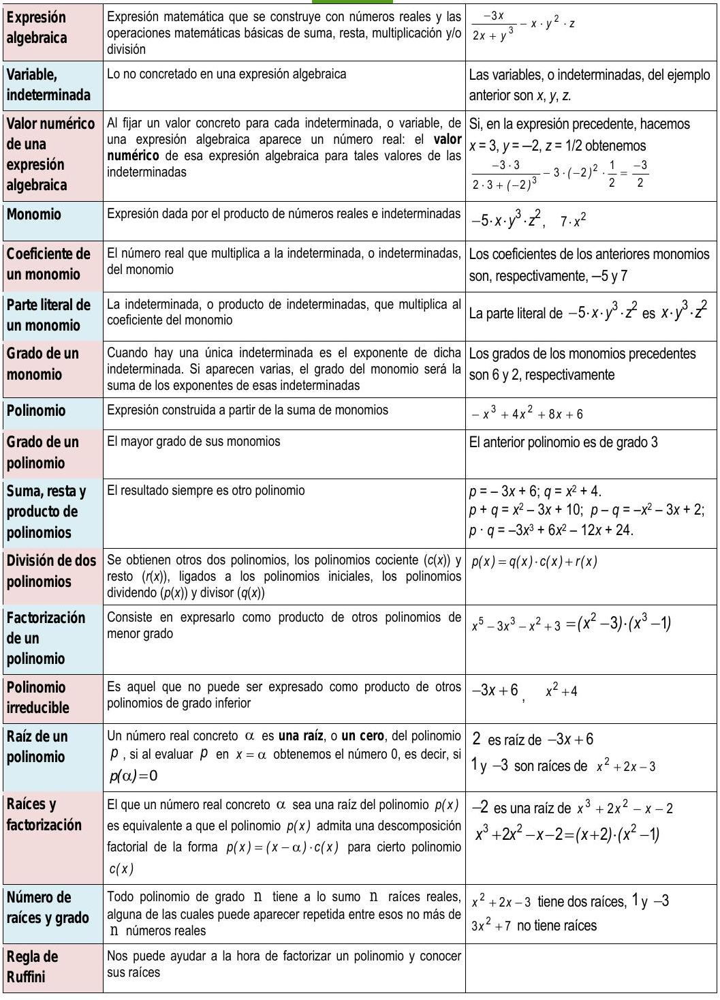

# Expresiones algebraicas. Polinomios

## Actividades propuestas

### Expresiones algebraicas

1.  A finales de cada mes la empresa de telefonia móvil nos proporciona
    la factura mensual. En ella aparece mucha información, en
    particular, el número total de llamadas realizadas (N) asi como la
    cantidad total de minutos de conversación (M). Con los datos del
    anterior ejemplo, justifica que el importe de las llamadas
    efectuadas durante ese mes es:
    $(0.05 \cdot M)+(0.12 \cdot N)=0.05 \cdot M+0.12 \cdot N$ euros.

2.  Escribe en lenguaje algebraico los siguientes enunciados, referidos
    a dos números cualesquiera $x$ e $y$:

    a)  La mitad del opuesto de su suma
    
    b) La suma de sus cubos

    c)  El cubo de su suma

    d)  El inverso de su suma

    e)  La suma de sus inversos

3.  Una tienda de ropa anuncia en sus escaparates que está de rebajas y
    que todos sus artículos están rebajados un 20% sobre el precio
    impreso en cada etiqueta. Escribe lo que pagaremos por una prenda en
    función de lo que aparece en su etiqueta.

4.  El anterior comercio, en los últimos dias del periodo de rebajas,
    desea deshacerse de sus existencias y para ello ha decidido aumentar
    el descuento. Mantiene el 20% para la compra de una única prenda
    y, a partir de la segunda, e descuento total aumenta un 5% por
    cada nueva pieza de ropa, hasta un máximo de 10 articulos. Analiza
    cuánto pagaremos al realizar una compra en función de la suma total
    de las cantidades que figuran en las etiquetas y del número de
    artículos que se adquieran.

5.  Calcula el valor numérico de las siguientes expresiones algebraicas
    para el valor o valores que se indican:

    a)  $x^{2}+7 x-12$ para $x=0$.

    b)  $(a+b)^{2}-\left(a^{2}+b^{2}\right)$ para $a=-3$ y $b=4$.

    c)  $a^{2}-5 a+2$ para $a=-1$.

6.  Indica, en cada caso, el valor numérico de la siguiente expresión:
    $10 x+20 y+30 z$

    a)  $x=1, y=2, z=1$

    b)  $x=2, y=0, z=5$

    c)  $x=0, y=1, z=0$.

### Polinomios. Suma y producto

1.  Realiza las siguientes sumas de polinomios:

    a)  $\left(x^{2}-x\right)+\left(-2 x^{2}-3 x+1\right)+\left(2 x^{3}-2 x^{2}+x-2\right)$

    b)  $-x^{4}+\left(x^{3}+2 x-3\right)+\left(-3 x^{2}-5 x+4\right)+\left(2 x^{3}-x+5\right)$

10. Escribe el polinomio opuesto de cada uno de los siguientes
    polinomios:

    a)  $3 x^{4}+5 x^{3}+x^{2}+4 x-1$

    b)  $7 x$

    c)  $-x^{4}+3 x^{2}$

11. Considera los polinomios
    $p \equiv-x^{3}-5 x+2$, $q \equiv 3 x^{2}+3 x+1$, asi como el
    polinomio suma $s \equiv p+q$. Halla los valores que adopta cada uno
    de ellos para $x=-2$, es decir, calcula $p(-2)$, $q(-2)$ y $s(-2)$.
    Estudia si existe alguna relación entre esos tres valores.

12. Obtén el valor del polinomio $p \equiv-x^{3}-5 x+2$ en $x=3$. ¿Qué
    valor toma el polinomio opuesto de $p$ en $x=3$?

13. Efectúa los siguientes productos de polinomios:

    a)  $\left(-4 x^{3}+2 x\right) \cdot\left(-3 x^{2}\right)$

    b)  $\left(2 x^{4}+x\right) \cdot(-3 x-4)$

    c)  $\left(2 x^{3}+x^{2}-x\right) \cdot\left(3 x^{2}-x\right)$

    d)  $(-1) \cdot\left(7 x^{3}-4 x^{2}-3 x+1\right)$

14. Realiza las siguientes diferencias de polinomios:

    a)  $\left(-4 x^{3}+2 x\right)-\left(-3 x^{2}\right)$

    b)  $\left(2 x^{4}+x\right)-(-3 x-4)$

    c)  $\left(3 x^{2}-x\right)-\left(2 x^{3}+x^{2}-x\right)$

15. Multiplica cada uno de los siguientes polinomios por un número de
    tal forma que surjan polinomios mónicos:

    $4 x^{3}-3 x^{2}+2 x$

    $-2 x^{4}+x-1$

    $-x^{2}+x-7$

16. Calcula y simplifica los siguientes productos:

    a)  $3 x \cdot\left(2 x^{2}+4 x-6\right)$

    b)  $(3 x-4) \cdot(4 x+6)$

    c)  $\left(2 a^{2}-5 b\right) \cdot \left(4 b-3 a^{3}\right)$

    d)  $(3 a-6) \cdot(8-2 a) \cdot(9 a-2)$

17. Realiza los siguientes productos de polinomios:

    a)  $x^{2} \cdot \left(-2 x^{2}-3 x+1\right) \cdot 2 x^{3}$

    b)  $(2 x-3) \cdot \left(-3 x^{2}-5 x+4\right) \cdot(-x)$

18. De cada uno de los siguientes polinomios extrae algún factor que sea
    común a sus monomios:

    a)  $-15 x^{3}-20 x^{2}+10 x$

    b)  $24 x^{4}-30 x^{2}$

### División de polinomios

20. Divide los siguientes polinomios:

    a) $2 x^{3}-x^{2}-x+7$ entre $x^{2}-2 x+4$

    b)  $-10 x^{3}-2 x^{2}+3 x+4$ entre $5 x^{3}-x^{2}-x+3$

    c) $4 x^{4}-6 x^{3}+6 x^{2}-3 x-7$ entre $-2 x^{2}+x+3$

    d)  $-8 x^{5}-2 x^{4}+10 x^{3}+2 x^{2}+3 x+5$ entre $4 x^{3}+x^{2}+x-1$
    
    e) $-6 x^{5}+x^{2}+1$ entre $x^{2}+1$

21. Encuentra dos polinomios tales que al dividirlos aparezca $q(x) = x^2+x-3$ como polinomio cociente y $r(x) = -3x^2 + 1$ como resto.

22. Efectúa los siguientes cálculos:
    
    a) $\frac{2 x+1}{x^{2}+1}+\frac{3}{x}$

    b) $\frac{1}{x-2}-\frac{2}{x+1}$
    
    c) $\frac{-x}{x^{2}+3 x} \cdot \frac{1}{x-1}$
    
    d) $\frac{x-2}{x^{2}+3 x}: \frac{x-2}{x+3}$

23. Realiza las siguientes operaciones alterando, en cada apartado,
    únicamente uno de los denominadores, y su respectivo numerador:
    
    a) $\frac{-x^{2}+x-1}{x^{3}}+\frac{3 x-2}{x^{2}}$

    b)  $\frac{x-2}{x^{2}+3 x}-\frac{4}{x+3}$

24. Comprueba las siguientes identidades simplificando la expresión del
    lado izquierdo de cada igualdad:

    a)  $\frac{8 a^{4} b^{2}}{2 a^{2} b}=4 a^{2} b$

    b)  $\frac{4 x^{3} y^{2}-3 x y^{2}}{2 x y}=2 x^{2} y-\frac{3}{2} y$

    c)  $\frac{3 x^{2}-9 x}{6 x+12}=\frac{x^{2}-3 x}{x+4}$

    d)  $\frac{6 y^{3}+4 y^{2}}{2 y^{2}-8 y}=\frac{3 y^{2}+2 y}{y-4}$

    e)  $\frac{6 a^{2} b^{3}+2 a^{3} b-4 a b}{2 a b^{2}+8 a^{2} b}=\frac{3 a b^{2}+a^{2}-2}{b+4 a}$

25. Calcula los siguientes cocientes:

    a)  $\left(3 x^{3}-9 x^{2}-6 x\right): 3 x$

    b)  $\left(7 a^{3}-70 a^{2}-21\right): 7$

    c)  $\left(25 x^{4}-10 x^{2}\right): 5 x^{2}$

    d)  $\left(3 x^{2} y^{3}-8 x y^{2}\right): x y^{2}$

26. Simplifica las siguientes fracciones algebraicas:

    a) $\frac{3 x^{2}-6 x}{9 x^{2}+15}$

    b)  $\frac{a^{3}-5 a^{2}}{7 a^{3}+4 a^{2}}$

    c)  $\frac{x^{2} y+3 x y^{2}}{4 x y}$

    d)  $\frac{2 a^{2} b^{2}+3 a b}{a^{3} b-a b}$

### Descomposición factorial

1.  Completa, cuando sea posible, las siguientes factorizaciones:

    a)  $-2 x^{3}+2 x=-2 x \cdot 0$

    b)  $-6 x^{2}+5 x+6=(2 x-3) \cdot 0$

    c)  $-6 x^{4}+3 x^{3}-3 x+6=\left(2 x^{2}-x+1\right) \cdot 0$

    d)  $-6 x^{4}+3 x^{3}-3 x+6=\left(2 x^{2}-x+2\right) \cdot 0$

28. Determina un polinomio de grado 4 que admita una descomposición
    factorial en la que participe el polinomio $6 x^{3}-x^{2}+3 x-1$.

29. Estudia si los siguientes números son o no raíz de los polinomios
    indicados:

    -   $x=3$ de $x^{3}-3 x^{2}+1$

    -   $x=-2$ de $x^{3}+3 x^{2}+3 x+2$

    -   $x=1$ de $x^{3}-3 x^{2}+x+1$

    -   $x=0$ de $x^{3}-3 x^{2}+1$

    -   $x=-1$ de $x^{3}-3 x^{2}-x+3$

1.  Supongamos que tenemos dos polinomios, $P_{1}(x)$ y $P_{2}(x)$, y un
    número real $\alpha$.

    -   Si $\alpha$ es una raíz de $p_{1}(x)$, ¿también es raíz del
        polinomio suma $p_{1}(x)+p_{2}(x)$?

    -   Si $\alpha$ es una raíz de $p_{1}(x)$, ¿también es raíz del
        polinomio producto $p_{1}(x) \cdot p_{2}(x)$?

    -   ¿Hay alguna relación entre las raíces del polinomio $p_{1}(x)$ y las
        del polinomio $4 \cdot p_{1}(x)$?

31. Construye un polinomio de grado 3 tal que posea tres raíces
    distintas.

32. Determina un polinomio de grado 3 tal que tenga, al menos, una raíz
    repetida.

33. Construye un polinomio de grado 3 de forma que tenga una única raíz.

34. Conjetura, y luego demuestra, una ley que nos permita saber cuándo
    un polinomio cualquiera
    $a_{n} x^{n}+a_{n-1} x^{n-1}+ \ldots +a_{1} x+a_{0}$ admite al
    número 0 como raíz.

35. Demuestra una norma que señale cuándo un polinomio cualquiera
    $a_{n} x^{n}+a_{n-1} x^{n-1}+ \ldots +a_{1} x+a_{0}$ admite al
    número 1 como raíz

36. Obtén todas las raíces de cada uno de los siguientes polinomios:

    -   $x+7$

    -   $-x+5$

    -   $2 x-3$

    -   $-4 x-9$

    -   $-2 x$

    -   $x^{2}-3 x$

    -   $4 x^{2}-x-3$

    -   $x^{3}-x$

    -   $x^{3}+x$

37. Usa la regla de Ruffini para realizar las siguientes divisiones de
    polinomios:

    a)  $-2 x^{2}+x+1$ entre $x+1$
    
    b) $x^{3}+2 x^{2}-2 x+1$ entre $x+2$
    
    c) $4 x^{3}-3 x^{2}-1$ entre $x-1$

    d)  $x^{3}-9 x+1$ entre $x-3$

38. Emplea la regla de Ruffini para dictaminar si los siguientes números
    son o no raíces de los polinomios citados:

    a)  $\alpha=3$ de $x^{3}-4 x^{2}+5$

    b)  $\beta=-2$ de $-x^{3}-2 x^{2}+x+2$

    c)  $\gamma=1$ de $-2 x^{4}+x+1$
    
    d) $\sigma=-1$ de $2 x^{3}+2 x^{2}$

39. Utiliza la regla de Ruffini para conocer el valor del polinomio
    $-x^{3}+2 x^{2}+x+2$ en $x=3$.

40. Estudia si es posible usar la regla de Ruffini, de alguna forma,
    para dividir $x^{3}+3 x^{2}+3 x+2$ entre $2 x+6$.

41. Para cada uno de los siguientes polinomios señala, en primer lugar,
    qué números enteros son candidatos a ser raíces suyas y, después,
    determina cuáles lo son:
    
    a) $x^{3}-x^{2}+2 x-2$
    
    b) $x^{4}+4 x^{3}+4 x^{2}+4 x+3$

    c) $2 x^{3}+x^{2}-18 x-9$
    
    d) $x^{4}+2 x^{3}+3 x^{2}+6 x$

42. Completa el ejemplo precedente comprobando que, en efecto,
    $\frac{-1}{2}$ es raíz del polinomio $2 x^{3}+x^{2}-18 x-9$.

43. Para cada uno de los siguientes polinomios indica qué números
    racionales son candidatos a ser raíces suyas y, después, determina
    cuáles lo son:

    a)  $3 x^{2}+4 x+1$

    b)  $2 x^{3}-9 x^{2}+12 x-4$

44. Simplifica, si es posible, las siguientes expresiones

    a)  $\frac{x^{2}+4 x}{x^{3}+3 x^{2}-6 x-8}$
    
    b) $\frac{x^{2}-1}{x^{3}+3 x^{2}-6 x-8}$
    
    c) $\frac{x^{2}-1}{x^{3}+x^{2}-6 x}$

45. Realiza las siguientes operaciones teniendo en cuenta las
    factorizaciones de los denominadores:

    a)  $\frac{5}{-3 x+12}+\frac{x+2}{x^{2}-4 x}$

    b)  $\frac{-x}{x^{2}-2 x+1}-\frac{3 x-1}{x^{2}-1}$

46. Realiza los cálculos:

    a) $(1+3 a)^{2}$
    
    b) $(-x+3)^{2}$
    
    c) $(-3 x-2)^{2}$
    
    d) $\left(x^{2}-1\right)^{3}$
    
    e) $(4 x+2)^{3}$

47. Obtén las fórmulas de los cuadrados de los siguientes trinomios:
 
    a) $(a+b+c)^{2}$
    
    b) $(a+b-c)^{2}$

48. Desarrolla las siguientes potencias:

    a) $(2 x+3 y)^{2}$
    
    b) $(3 x+y / 3)^{2}$
    
    c) $(5 x-5 / x)^{2}$
    
    d) $(3 a-5)^{2}$
    
    e) $\left(a^{2}-b^{2}\right)^{2}$
    
    f) $(3 / 5 y-2 / y)^{2}$
    
49. Expresa como cuadrado de una suma o de una diferencia las siguientes
    expresiones algebraicas:

    a)  $a^{2}+6 a+9$

    b)  $4 x^{2}-4 x+1$

    c)  $b^{2}-10 b+25$

    d)  $4 y^{2}+12 y+9$

    e)  $a^{4}-2 a^{2}+1$
    
    f) $y^{4}+6 y^{2}+9$

50. Efectúa estos productos:

    a) $(4 x+3 y) \cdot(4 x-3 y)$

    b) $\left(2 x^{2}+4\right) \cdot\left(2 x^{2}-4\right)$

    c) $\left(-x^{2}+3 x\right) \cdot\left(x^{2}+3 x\right)$

51. De acuerdo con lo expuesto, factoriza los siguientes polinomios:

    a)  $x^{2}-2 x+1$

    b)  $3 x^{2}+18 x+27$

    c)  $4 x^{5}-16 x^{3}$

52. Calcula los siguientes productos:

    a) $(3 x+1) \cdot(3 x-1)$

    b) $(2 a-3 b) \cdot(2 a+3 b)$

    c) $\left(x^{2}-5\right) \cdot\left(x^{2}+5\right)$

    d) $\left(3 a^{2}+5\right) \cdot\left(3 a^{2}-5\right)$

53. Expresa como suma por diferencia las siguientes expresiones:

    a)  $9 x^{2}-25$

    b)  $4 a^{4}-81 b^{2}$

    c)  $49-25 x^{2}$

    d)  $100 a^{2}-64$

54. Simplifica las siguientes fracciones algebraicas:
    
    a) $\frac{x^{2}-1}{3 x+3}$

    b) $\frac{2 x^{2}+12 x+18}{x^{2}-9}$

    c) $\frac{6-3 a}{a^{2}-4}$

## Ejercicios y problemas

1.  Estudia si hay números reales en los que las siguientes expresiones
    no pueden ser evaluadas:

    $\frac{3 x-6}{(x+2) \cdot(2 x-14)}$

    $\frac{-x}{x^{2}-4 x+4}$

    $\frac{3 x^{3}-x}{-2 x^{4}-3 x^{2}-4}$

    $\frac{5 x-y+1}{x^{2}+y^{2}}$

5.  Una persona tiene ahorrados 1000 euros y decide depositarlos en un
    producto bancario con un tipo de interés anual del 3%. Si decide
    recuperar sus ahorros al cabo de dos años, ¿cuál será la cantidad
    total de la que dispondrá?

6.  Generalicemos el ejercicio anterior: Si ingresamos $X$ euros en un
    depósito bancario cuyo tipo de interés es del $i\%$ anual, ¿cuál
    será la cantidad que recuperaremos al cabo de $n$ años?

7.  Construye un polinomio de grado 2, $p(x)$, tal que $p(3)=-7$.

8.  Consideremos los polinomios
    $p(x)=-5 x^{3}+x^{2}-3 x-2, q(x)=3 x^{4}+2 x^{3}-x^{2}+2 x+7$ y
    $r(x)=4 x^{2}+5 x-1$. Realiza las siguientes operaciones:
    
    a)  $p+q+r$

    b)  $p-q$

    c)  $p \cdot r$

    d)  $p \cdot r-q$

9.  Calcula los productos:
    
    a) $\left(\frac{a x}{3}-\frac{b y}{2}\right) \cdot\left(\frac{-x y}{6}\right)$ 
    
    b) $(0.3 x-0.2 y+0.1 z) \cdot(0.1 x+0.2 y-0.3 z)$
    
    c) $(x-1)(x-a)(x-b)$

10. Efectúa las divisiones de polinomios:
    
    a)  $2 x^{4}-3 x^{3}-8 x^{2}+9 x-1$ entre $2 x^{2}+3 x-3$

    b)  $4 x^{5}-5 x^{4}+6 x^{3}+2 x^{2}-10 x-6$ entre $x^{3}+2 x+3$

1.  Calcula los cocientes:
   
    a)  $\left(5 x^{4}\right):\left(x^{2}\right)$

    b)  $\left(3 x^{2} y^{4} z^{6}\right):\left((1 / 2) x y^{3} z^{5}\right)$
    
    c)  $\left(x^{4}+2 x^{2} y+y^{2}\right):\left(x^{2}+y\right)$

1.  Realiza las operaciones entre fracciones algebraicas:

    $\frac{x-1}{x^{2}-3 x}+\frac{2 x}{x^{2}-6 x+9}$

    $\frac{x-1}{x^{2}-3 x}-\frac{2 x}{x^{2}-6 x+9}$

    $\frac{x-1}{x^{2}-3 x} \cdot \frac{2 x}{x^{2}-6 x+9}$

    $\frac{x-1}{x^{2}-3 x}: \frac{2 x}{x^{2}-6 x+9}$

12. Construye un polinomio de grado 2 tal que el número -5 sea raíz suya.

14. Determina un polinomio de grado 3 tal que sus raíces sean 6, -3 y 0.

15. Construye un polinomio de grado 4 tal que tenga únicamente dos
    raíces reales.

16. Encuentra un polinomio $q(x)$ tal que al dividir
    $p(x)=x^{4}+x^{3}+x^{2}+x+1$ entre $q(x)$ se obtenga como polinomio
    resto $r(x)=5 x^{2}+5 x+1$.

17. Halla las raíces enteras de los siguientes polinomios:

    $3 x^{3}+11 x^{2}+5 x-3$

    $3 x^{3}+2 x^{2}+8 x-3$

    $3 x^{3}+5 x^{2}+x-1$

    $2 x^{3}+x^{2}-6 x-3$

18. Obtén las raíces racionales de los polinomios del ejercicio
    anterior.

19. Descompón los siguientes polinomios como producto de polinomios
    irreducibles:

    $3 x^{3}+11 x^{2}+5 x-3$

    $3 x^{3}+5 x^{2}+x-1$

    $2 x^{3}+x^{2}-6 x-3$

    $3 x^{3}-6 x^{2}+x-2$

20. Calcula las potencias:
    
    a) $(x-2 y+z)^{2}$

    b)  $(3 x-y)^{3}$

    c)  $\left((1 / 2) a+b^{2}\right)^{2}$

    d)  $\left(x^{3}-y^{2}\right)^{2}$

1.  Analiza si los siguientes polinomios han surgido del desarrollo de
    potencias de binomios, 0 trinomios, o de un producto suma por
    diferencia. En caso afirmativo expresa su procedencia.

    $x^{2}+6 x+9$

    $x^{4}-8 x^{2}+16$

    $x^{2}+\sqrt{20} x y+5 y^{2}$

    $x^{4}+2 x^{3}+x^{2}+2 x+1$

    $x^{4}-2 x^{3}+x^{2}+2 x+1$

    $x^{2}-36$

    $5 x^{2}+1$

    $5 x^{2}-11$

    $x^{2}-3 y^{2}$

22. Descompón en factores:
    
    a) $x^{4}-1$

    b)  $x^{2}-y^{2}$

    c)  $x^{2} y^{2}-z^{2}$

    d)  $x^{4}-2 x^{2} y+y^{2}$

1.  Con este ejercicio se pretende mostrar la conveniencia a la hora de
    no operar una expresión polinómica que tenemos factorizada total o
    parcialmente.
    
    a) Comprueba la igualdad $x^{4}-5 x^{2}+6=\left(x^{2}-2\right) \cdot\left(x^{2}-3\right)$
    
    b) Determina todas las raíces del polinomio $x^{4}-5 x^{2}+6$.

2.  Factoriza numerador $y$ denominador y simplifica:

    a) $\frac{x^{2}-2 x+1}{x^{2}-1}$

    b)  $\frac{x^{4}+2 x^{2} y^{2}+y^{4}}{x^{2}+y^{2}}$

    c)  $\frac{x^{3}-x}{x^{4}-1}$

1.  Efectúa las siguientes operaciones y simplifica todo lo posible:

    a)  $\frac{2}{x(5-x)}-\frac{3}{2(5-x)}$

    b)  $\frac{x-y}{x+y} \cdot \frac{x^{2}+y^{2}}{x^{2}-y^{2}}$

    c)  $\frac{2 x+1}{4 x^{2}-1}$

26. Efectúa las siguientes operaciones y simplifica todo lo posible:

    a)  $\frac{x^{4}-1}{x^{7}}: \frac{x^{2}+1}{x^{8}}$

    b)  $\frac{2 x+3 y}{a-b}-\frac{3 x+4 y}{2 a-2 b}$

    c)  $-4 x+\left(1-x^{4}\right)\left(\frac{x+1}{1-x}-\frac{1-x}{1+x}\right)$

27. Efectúa las siguientes operaciones y simplifica todo lo posible:

    a)  $\left(x^{4}-\frac{1}{x^{2}}\right):\left(x^{2}+\frac{1}{x}\right)$

    b)  $\frac{x^{3}-3 a x^{2}+3 a^{2} x-a^{3}}{x+a}: \frac{x-a}{x+a}$

    c)  $\left(\frac{a+b}{a-b}-\frac{a-b}{a+b}\right): \frac{a b}{a+b}$

28. Efectúa las siguientes operaciones y simplifica todo lo posible:

    a)  $\frac{\frac{1}{a}-\frac{1}{x+y}}{\frac{1}{a}+\frac{1}{x+y}}: \frac{\frac{1}{x}-\frac{1}{a+y}}{\frac{1}{x}+\frac{1}{a+y}}$

    b)  $\left(1-\frac{1}{x}+\frac{3}{x^{2}}+\frac{2}{x^{3}}\right):\left(\frac{1}{x}-\frac{3}{x^{2}}-\frac{2}{x^{3}}\right)$

    c)  $\frac{\frac{3}{x}+\frac{2}{y}}{\frac{1}{x}-\frac{3}{y}} \cdot \frac{2}{x}-\frac{1}{\frac{3}{x}+\frac{5}{y}}$

## Autoevaluación

1.  Señala los coeficientes que aparecen en las siguientes expresiones
    algebraicas:

    a)  $\frac{3 x-7}{2-3 y^{2}}+5 x y^{3}-\frac{6}{z}$

    b)  $-2 x^{5}+x^{4}-x^{3}+5 x-1$

    c)  $5 \cdot \sqrt{2} \cdot x \cdot y^{2} \cdot z$

3.  El valor numérico de la expresión
    $\frac{3 x-7}{2-3 y^{2}}+5 x y^{3}-\frac{6}{z}$ en $x=2$, $y=-1$, $z=-1$
    es:

    a)  17

    b)  15

    c)  $-3$

    d)  $-5$

4.  Completa adecuadamente las siguientes frases:

    a)  La suma de dos polinomios de grado dos es siempre otro polinomio de
    grado.

    b)  La suma de tres polinomios de grado dos es siempre otro polinomio de
    grado.

    c)  El producto de dos polinomios de grado dos es siempre otro polinomio
    de grado.

    d)  La diferencia de dos polinomios de grado dos es siempre otro
    polinomio de grado \ldots

5.  Al dividir el polinomio $p(x)=x^{5}+x^{4}+x^{3}+1$ entre
    $q(x)=x^{2}+x+1$ el polinomio resto resultante:

    a)  debe ser de grado 2.

    b)  puede ser de grado 2.

    c)  debe ser de grado menor que 2.

    d)  ninguna de las opciones precedentes.

6.  Considera el polinomio $2 x^{4}-7 x^{3}+5 x^{2}-7 x+3$. ¿Cuáles de
    los siguientes números enteros son razonables candidatos para ser
    una raíz suya?

    a)  3

    b)  2

    c)  $-5$

    d)  $-7$

7.  Considera el polinomio $2 x^{4}+7 x^{3}+x^{2}-7 x-3$. ¿Cuáles de los
    siguientes números racionales son razonables candidatos para ser una
    de sus raíces?

    a)  $-3$

    b)  2 y $\frac{-1}{2}$

    c)  $-3$ y $\frac{1}{3}$

    d)  $-3 y \frac{3}{2}$

8.  Todo polinomio con coeficientes enteros de grado tres

    a)  tiene tres raíces reales.

    b)  tiene, a lo sumo, tres raíces reales.

    c)  tiene, al menos, tres raíces.

9.  ¿Es posible que un polinomio, con coeficientes enteros, de grado
    cuatro tenga exactamente tres raíces, ya sean diferentes o con
    alguna múltiple?

10. Justifica la veracidad o falsedad de cada una de las siguientes
    frases:

    a)  La regla de Ruffini sirve para dividir dos polinomios cualesquiera.

    b)  La regla de Ruffini permite dictaminar si un número es raíz o no de
    un polinomio.

    c)  La regla de Ruffini solo es válida para polinomios con coeficientes
    enteros.

    d)  La regla de Ruffini es un algoritmo que nos proporciona todas las
    raíces de un polinomio.

11. Analiza si puede haber algún polinomio de grado ocho que no tenga
    ninguna raíz
    
## Resumen

{ width=50% }