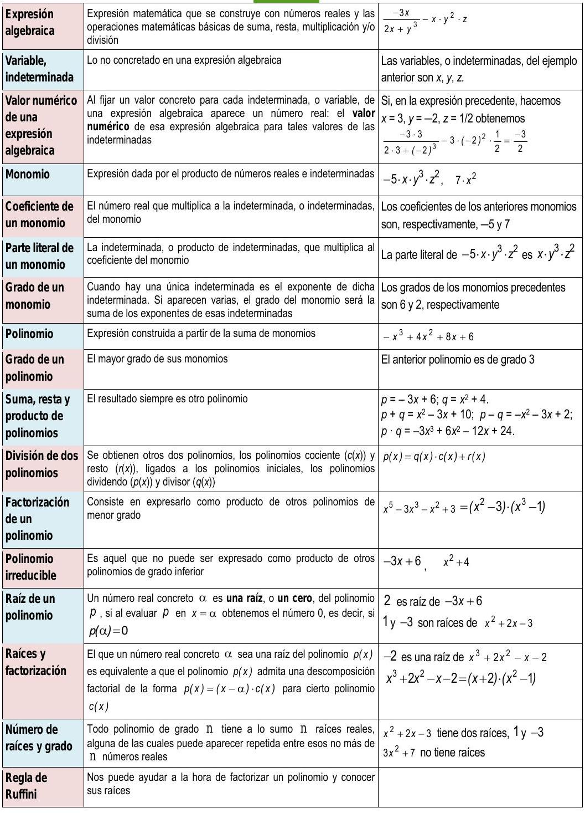

# Potencias y raíces

## Actividades propuestas

### Potencias

1.  Calcula las siguientes potencias:

    a)  $-x^{3}$

    b)  $(x+1)^{3}$

    c)  $-(-2 x)^{2}$

1.  Efectúa las siguientes operaciones con potencias:

    a)  $(x+1) \cdot (x+1)^{3}$

    b)  $(x+2)^{3}:(x+2)^{4}$

    c)  $\left[(x-1)^{33}\right]^{4}$

    d)  $(x+2) \cdot(x+1)^{-3}$

### Potencias y radicales

1.  Calcula:

    a)  $\left(\sqrt[3]{a^{6} \cdot b^{9}}\right)^{2}$

    b)  $\sqrt[3]{\frac{2}{3}} \cdot \sqrt[3]{\frac{3}{4}}$

    c)  $\left(\sqrt[12]{(x+1)^{3}}\right)^{2}$

5.  Hallar

    a)  $\sqrt[2]{\sqrt[4]{\frac{x}{5 y}}}: \sqrt{\sqrt[4]{\frac{3 x}{y^{2}}}}$

    b)  $\sqrt{\frac{5}{3}}: \sqrt{\frac{2}{3}}$

6.  Realiza las siguientes operaciones con radicales:

    a)  $\sqrt[4]{\frac{x}{5 y}}: \sqrt[4]{\frac{3 x}{y^{2}}}$

    b)  $\left(\sqrt[5]{(x+3)^{2}}\right)^{3}$

### Operaciones con radicales. Racionalización

1.  Escribe bajo un solo radical y simplifica:
    $\sqrt[2]{2 \cdot \sqrt[2]{3 \cdot \sqrt[2]{4 \cdot \sqrt[2]{5 \cdot \sqrt[2]{6 \sqrt[2]{8}}}}}}$

2.  Calcula y simplifica:
    $\frac{\sqrt[4]{x^{3} \cdot y^{3}} \cdot \sqrt[3]{x^{4} \cdot y^{5}}}{\sqrt[6]{x^{5} \cdot y^{4}}}$

3.  Realiza la siguiente operación:
    $\sqrt{x^{3}}+\sqrt{16 x^{7}}+\sqrt{x}$

4.  Calcula y simplifica:
    $\sqrt[2]{\frac{3}{x}} \cdot \sqrt[3]{\frac{x^{2}}{8}} \cdot \sqrt[4]{\frac{9}{5}}$

5.  Racionaliza la expresión: $\frac{x+3 y}{\sqrt{x}-\sqrt{2 y}}$

6.  Racionaliza: $\frac{3 \sqrt{3}+2 \sqrt{2}}{\sqrt{3}+\sqrt{2}}$

7.  Racionaliza: $\frac{5 \sqrt{5}-2 \sqrt{2}}{\sqrt{5}-2}$

### Notación científica

1.  Calcula:

    a)  $\left(7.83 \cdot 10^{-5}\right) \cdot\left(1.84 \cdot 10^{13}\right)$

    b)  $\left(5.2 \cdot 10^{-4}\right):\left(3.2 \cdot 10^{-6}\right)$

2.  Efectúa y expresa el resultado en notación cientifica:

    a)  $\frac{3.10^{-5}+7.10^{-4}}{10^{6}-5.10^{5}}$

    b)  $\frac{7.35 .10^{4}}{5.10^{-3}}+3.2 \cdot 10^{7}$

3.  Realiza las siguientes operaciones y efectúa el resultado en
    notación cientifica:

    a)  $\left(4.3 \cdot 10^{3}-7.2 \cdot 10^{5}\right)^{2}$

    b)  $\left(7.8 \cdot 10^{-7}\right)^{3}$

### Logaritmos

1.  Empareja cada logaritmo con su potencia:

    --------------  ------------------  ------------------  ------------------
     $2^{5}=32$      $\log _{5} 1=0$     $2^{0}=1$           $5^{2}=25$
     $5^{1}=5$       $\log _{2} 2=1$     $5^{0}=1$           $\log _{2} 32=5$
     $2^{1}=2$       $\log _{2} 1=0$     $\log _{5} 5=1$     $\log _{5} 25=2$
     $2^{4}=16$      $\log _{3} 81=4$    $\log _{2} 16=4$    $3^{4}=81$
    --------------  ------------------  ------------------  ------------------

2.  Calcula utilizando la definición de logaritmo:

    a) $\log _{2} 2^{5}$
    b) $\log _{5} 25$
    c) $\log _{2} 2^{41}$
    d) $\log _{5} 5^{30}$

3.  Calcula utilizando la definición de logaritmo:
    a) $\log _{3} 27$ 
    b) $\log _{10} 100$
    c) $\log _{1 / 2}(1 / 4)$
    d) $\log _{10} 0.0001$

4.  Calcula $x$ utilizando la definición de logaritmo:
    a) $\log _{2} 64=x$
    b) $\log _{1 / 2} x=4$
    c) $\log _{x} 25=2$

5.  Calcula utilizando la definición de logaritmo:

    a)  $\log _{2} 64+\log _{2} 1 / 4-\log _{3} 9-\log _{2} \sqrt{2}$

    b)  $\log _{2} 1 / 32+\log _{3} 1 / 27-\log _{2} 1$

6.  Desarrolla las expresiones que se indican:

    $$\begin{array}{ll}
    \text { a) } \ln \sqrt[5]{\frac{4 x^{2}}{e^{3}}} & \text { b) } \log \left(\frac{a^{3} \cdot b^{2}}{c^{4} \cdot d}\right)
    \end{array}$$

7.  Expresa los logaritmos de los números siguientes en función de
    $\log 3=0.4771212$

    a)  81

    b)  27

    c)  59049

8.  Simplifica la siguiente expresión:

    $$\frac{1}{2} \log m-2 \log t-\log p+\frac{5}{2} \log h$$

## Ejercicios y problemas

### Potencias

1.  Expresa en forma exponencial:

    a)  $\frac{1}{64}$

    b)  $\frac{t}{t^{5}} \quad$ c) $\left(\frac{1}{z+1}\right)^{2}$

    d)  $\frac{27^{-2}}{81^{-5}}$

    e)  $\frac{x^{-2} \cdot y^{-7}}{x^{8} \cdot y^{-4}}$

3.  Calcula:

    a)  $4^{\frac{1}{2}}$

    b)  $125^{\frac{1}{3}}$

    c)  $625^{\frac{5}{6}}$

    d)  $\left(64^{\frac{2}{3}}\right)^{\frac{5}{6}}$

    e)  $\left(8^{\frac{-4}{3}}\right)^{\frac{2}{5}}$

### Radicales

1.  Expresar en forma de radical:

    a) $x^{\frac{7}{9}}$

    b) $\left(m^{5} \cdot n^{3}\right)^{\frac{1}{3}}$

    c) $\left[\left(x^{2}\right)^{\frac{1}{3}}\right]^{\frac{1}{5}}$

    d) $a^{\frac{1}{2}} \cdot b^{\frac{1}{3}}$

2.  Expresar en forma exponencial:

    a)  $\left(\sqrt[3]{x^{2}}\right)^{5}$

    b)  $\sqrt{\frac{a^{13}}{a^{6}}}$

    c)  $\sqrt[n]{\sqrt[m]{a^{k}}}$

    d)  $\sqrt[3]{x^{(5 x+1)}}$

    e)  $\sqrt[4]{\left(x^{2}\right)^{(3 x+2)}}$
    
    f) $\sqrt[3]{\sqrt[4]{\sqrt[2]{\left(x^{2}\right)^{\frac{1}{5}}}}}$

6.  Expresa como potencia única:

    a)  $\frac{\sqrt[3]{a^{8}}}{a^{2}}$

    b)  $\frac{\sqrt{125}}{\sqrt[3]{25}}$

    c)  $\frac{\sqrt[3]{a^{2}}}{a \cdot \sqrt{a}}$

    d) $2 \cdot \sqrt[3]{\frac{1}{4}}$

    e) $a \cdot \sqrt{\frac{1}{a}}$
    
    f) $\frac{1}{2} \cdot \sqrt{2} \cdot \sqrt[4]{2}$

    g)  $\frac{\sqrt[3]{a^{2}}}{a^{3}} \cdot \frac{a^{3}}{\sqrt{a}}$

### Propiedades de los radicales

1.  Simplifica:

    a)  $\sqrt[9]{64}$

    b)  $\frac{\sqrt[5]{16}}{\sqrt{2}}$

    c)  $\frac{\sqrt[4]{a^{3} \cdot b^{5} \cdot c}}{\sqrt{a \cdot b^{3} \cdot c^{3}}}$

    d)  $\sqrt[3]{\sqrt[4]{x^{5} \cdot x^{7}}}$
    
    e)  $\left(\sqrt{\sqrt{\sqrt{2}}}\right)^{8}$

    f)  $\frac{\sqrt[4]{x^{3} \cdot y^{3} \cdot \sqrt[3]{x^{4} \cdot y^{5}}}}{\sqrt[6]{x^{5} \cdot y^{4}}}$

    g)  $\sqrt[5]{x^{2} \cdot 3 \cdot \sqrt[10]{x^{2} \cdot \sqrt{x^{3}}}}$

2.  Extraer factores del radical:

    a)  $\sqrt[3]{32 x^{4}}$

    b)  $\sqrt[3]{81 a^{3} b^{5} c}$

    c)  $\left(\sqrt{\sqrt{2}}\right)^{10}$

    d)  $4 \sqrt{\frac{25 a^{2} b}{c^{6}}}$

    d)  $\sqrt{\frac{8 a^{5}}{b^{4}}}$
    
    e)  $\sqrt{\frac{28 x^{5}}{75 y^{3}}}$
    
    f)  $\sqrt{\frac{32 a^{3}}{45 b^{4}}}$

3.  Introducir factores en el radical:

    a) $2 \sqrt{\frac{3}{2}}$ 
    
    b) $3 \sqrt{\frac{2}{3}}$

    c) $2 \sqrt[3]{\frac{1}{4}}$
    
    d) $2 \cdot \sqrt[4]{\frac{5}{12}}$
    
    e) $\frac{1}{2} \cdot \sqrt{12}$
    
    f) $\frac{2}{3} \sqrt[3]{\frac{9}{4}}$

### Operaciones con radicales

1.  Resuelve:
   
    a)  $\sqrt[3]{a} \cdot \sqrt[3]{a^{2}} \cdot \sqrt[3]{b^{4}} \cdot \sqrt[3]{b^{2}}$
    
    b) $\sqrt{5 a} \cdot \sqrt{10 ab} \cdot \sqrt{8 a^{3} b} \cdot \sqrt{a}$
    
    c) $\frac{\sqrt[6]{20}}{\sqrt[4]{10}}$
    
    d) $\sqrt[4]{\frac{5}{12}}: \sqrt[4]{\frac{20}{3}}$
    
    e) $\sqrt{\frac{3}{2}}: \sqrt{\frac{2}{3}}$
    
    f) $\frac{\sqrt[3]{4}}{\sqrt{2}}$
    
2.  Efectúa:

    a)  $\sqrt{18}+\sqrt{50}-\sqrt{2}-\sqrt{8}$

    b)  $\sqrt{50 a}-\sqrt{18 a}$ c) $\sqrt{320}+\sqrt{80}-\sqrt{500}$

    d)  $\sqrt{\frac{7}{64}}+\sqrt{\frac{7}{4}}$

    e)  $5 \sqrt{96}-\sqrt[5]{\frac{3}{32}}$

    f)  $\sqrt[3]{\frac{135}{8}}-\sqrt[3]{\frac{5}{8}}$

    g)  $\sqrt{150}+\sqrt{54}-\sqrt{24}$

### Racionalización

1.  Racionaliza los denominadores

    a)  $\frac{5}{\sqrt[3]{2}}$
    
    b)  $\frac{3}{2-\sqrt{3}}$

    c)  $\frac{4}{\sqrt{3}+\sqrt{2}}$

    d)  $\frac{6}{\sqrt{3}-\sqrt{2}}$

    e)  $\frac{\sqrt{3}}{\sqrt{2}+\sqrt{3}}$
    
    f)  $\frac{\sqrt{5}-\sqrt{3}}{\sqrt{5}+\sqrt{3}}$

13. Racionaliza y simplifica:

    a)  $\frac{11}{2 \cdot \sqrt{5}+3}$
    
    b) $\frac{\sqrt{2}}{2\sqrt{2}+3}$

    c)  $\frac{\sqrt{3}+2 \cdot \sqrt{5}}{\sqrt{6}-\sqrt{5}}$
    
    d) $\frac{\sqrt{3}+2 \sqrt{2}}{\sqrt{3}-2 \sqrt{2}}$

    e)  $\frac{4 \sqrt{15}-2 \sqrt{21}}{2 \sqrt{5}-\sqrt{7}}$

    f) $\frac{1}{x+\sqrt{x^{2}-1}}$

14. Efectúa y simplifica:

    a)  $\left(\frac{\sqrt{6}-\sqrt{3}}{\sqrt{6}+\sqrt{3}}\right)\left(3+2 \sqrt{2}\right)$

    b)  $\frac{\left(\sqrt{5}+1\right)^{2}}{\sqrt{5}-1}-3 \sqrt{5}$

    c)  $\left(1-\frac{\sqrt{3}}{1+\sqrt{3}}\right):\left(1+\frac{\sqrt{3}}{1-\sqrt{3}}\right)$

### Notación científica

1.  La masa del Sol es 330000 veces la de la Tierra, aproximadamente, y
    esta es $5,98 \cdot 10^{21}$ t. Expresa en notación cientifica la
    masa del Sol, en kilogramos.

2.  El ser vivo más pequeño es un virus que pesa del orden de
    $10^{-18} \mathrm{~g}$ y el más grande es la ballena azul, que pesa,
    aproximadamente, $138 \mathrm{~t}$. ¿Cuántos virus serian necesarios
    para conseguir el peso de la ballena?

3.  Los cinco paises más contaminantes del mundo (Estados Unidos, China,
    Rusia, Japón y Alemania) emitieron 12 billones de toneladas de
    CO2 en el año 1995, cantidad que representa el 53.5%
    de las emisiones de todo el mundo. ¿Qué de CO2 se
    emitió en el año 1995 en todo el mundo?

4.  Expresa en notación científica:

    a)  Recaudación de las quinielas en una jornada de la liga de fútbol:
        1628000 €.

    b)  Toneladas de CO2 que se emitieron a la atmósfera en
        1995 en Estados Unidos 5228,5 miles de millones.

    c)  Radio del átomo de oxigeno: $0.000000000066 \mathrm{~m}$.

5.  Efectúa y expresa el resultado en notación cientifica:

    a)  $\left(3 \cdot 10^{-7}\right) \cdot\left(8 \cdot 10^{18}\right)$
    
    b)  $\left(4 \cdot 10^{-12}\right) \cdot\left(5 \cdot 10^{-3}\right)$
    
    c)  $\left(5 \cdot 10^{12}\right):\left(2 \cdot 10^{-3}\right)$
    
    d)  $3.1 \cdot 10^{12}+2 \cdot 10^{10}$
    
    e)  $\left(4 \cdot 10^{5}\right)^{-2}$

6.  Expresa en notación cientifica y calcula:

    a)  $(75800)^{4}:(12000)^{4}$

    b)  $\frac{0.000541 \cdot 10318000}{1520000 \cdot 0.00302}$

    c)  $(0.0073)^{2} \cdot(0.0003)^{2}$

    d)  $\frac{2700000-13000000}{0.00003-0.00015}$

7.  Efectúa y expresa el resultado en notación cientifica:

    a)  $\frac{3 \cdot 10^{-5}+7 \cdot 10^{-4}}{10^{6}-5 \cdot 10^{5}}$

    b)  $\frac{7.35 \cdot 10^{4}}{5 \cdot 10^{-3}}+3.2 \cdot 10^{7}$
    
    c)  $\left(4.3 \cdot 10^{3}-7.2 \cdot 10^{5}\right)$

## Autoevaluación

1.  El número $8^{-3/4}$ vale:

    a)  Un dieciseisavo

    b)  Dos

    c)  Un cuarto

    d)  Un medio

3.  Expresa como potencia de base 2 cada uno de los números que van
    entre paréntesis y efectúa después la operación:
    $$\left(16^{1 / 4}\right) \cdot \left(\sqrt[6]{4}\right) \cdot \left(\frac{1}{8}\right)$$
    El resultado es:

    a)  $2^{-1 / 3}$

    b)  $2^{-5 / 4}$

    c)  $2^{-5 / 3}$

    d)  $2^{-5}$

4.  El número: $\sqrt[3]{4 \sqrt[3]{6 \sqrt{8}}}$ es igual a:

    a)  $6^{1 / 4}$

    b)  $2^{1 / 3}$

    c)  $2^{5 / 6} \cdot 6^{1 / 9}$

    d)  2

5.  ¿Cuál es el resultado de la siguiente expresión si la expresamos
    como potencia única?: $\frac{\sqrt[3]{8}}{\sqrt[3]{16}}$

    a)  $\frac{1}{2 \cdot \sqrt[3]{2}}$

    b)  $\frac{2}{2 \sqrt[3]{2}}$

    c)  $\frac{2}{3 \cdot \sqrt[3]{2}}$

    d)  $\sqrt[3]{2}$

6.  Simplificando y extrayendo factores la siguiente expresión tiene un
    valor: 
    $$\sqrt[2]{\sqrt{625 \cdot a^{6} \cdot b^{7} \cdot c^{6}}}$$

    a)  $5^{3} \cdot a \cdot b \cdot c^{2} \cdot \sqrt[4]{a \cdot b^{2} \cdot c}$

    b)  $5 \cdot a^{2} \cdot b \cdot c \cdot \sqrt[4]{a^{2} \cdot b^{3} \cdot c^{2}}$

    c)  $5 \cdot a \cdot b \cdot c \cdot \sqrt[4]{a^{3} \cdot b^{2} \cdot c^{3}}$

    d)  $5 \cdot a \cdot b \cdot c \cdot \sqrt[4]{a^{2} \cdot b^{3} \cdot c^{2}}$

7.  ¿Cuál de los siguientes valores es igual a $a^{3 / 2}$?

    a)  $a^{1 / 2 \cdot} a^{2}$

    b)  $a^{5 / 2} \cdot a^{-1}$

    c)  $\left(a^{2}\right)^{2}$

    d)  $a^{3} \cdot a^{-2}$

8.  ¿Cuál es el resultado de esta operación con radicales?
    $$\sqrt{63}-\frac{5}{2} \cdot \sqrt{28}+\frac{\sqrt{112}}{3}$$

    a)  $2 \cdot \sqrt{7}$

    b)  $\frac{11}{8} \cdot \sqrt{7}$

    c)  $-\frac{2}{3} \cdot \sqrt{7}$

    d)  $\frac{-2}{5} \cdot \sqrt{7}$

9.  Una expresión con un único radical de:
    $\sqrt[3]{2} \cdot \sqrt[4]{(x+2)^{3}} \cdot \sqrt{(x+1)}$ está dada
    por:

    a)  $\sqrt[6]{x^{2} \cdot(x+2) \cdot(x+1)}$

    b)  $\sqrt[8]{x^{2} \cdot(x+2)^{3} \cdot(x+1)}$

    c)  $\sqrt[12]{x^{8} \cdot(x+2)^{9} \cdot(x+1)^{6}}$

    d)  $\sqrt[12]{x^{2} \cdot(x+2)^{3} \cdot(x+1)}$

10. Para racionalizar la expresión:
    $\frac{2-\sqrt{3}}{2 \sqrt{3}+\sqrt{5}}$ hay que multiplicar
    numerador y denominador por

    a)  $\sqrt{3}-\sqrt{5}$

    b)  $2 \cdot \sqrt{3}-\sqrt{5}$

    c)  $2+\sqrt{5}$

    d)  $\sqrt{5}+\sqrt{3}$

11. ¿Cuál es el resultado en notación cientifica de la siguiente
    operación?
    $$5.83 \cdot 10^{9}+6.932 \cdot 10^{12}-7.5 \cdot 10^{10}$$

    a)  $6.86283 \cdot 10^{12}$

    b)  $6.86283 \cdot 10^{13}$

    c)  $6.8623 \cdot 10^{11}$

    d)  $6.8628 \cdot 10^{12}$

12. ¿Cuál es el resultado de la siguiente operación expresado en
    notación cientifica?:
    $\frac{5.24 \cdot 10^{10}}{6.3 \cdot 10^{-7}}$\
    
    a) $0.8317 \cdot 10^{17}$
    
    b) $8.317 \cdot 10^{16}$
    
    c) $8.317 \cdot 10^{15}$
    
    d) $83.17 \cdot 10^{16}$

## Resumen

{ width=50% }

# Expresiones algebraicas. Polinomios

## Actividades propuestas

### Expresiones algebraicas

1.  A finales de cada mes la empresa de telefonia móvil nos proporciona
    la factura mensual. En ella aparece mucha información, en
    particular, el número total de llamadas realizadas (N) asi como la
    cantidad total de minutos de conversación (M). Con los datos del
    anterior ejemplo, justifica que el importe de las llamadas
    efectuadas durante ese mes es:
    $(0.05 \cdot M)+(0.12 \cdot N)=0.05 \cdot M+0.12 \cdot N$ euros.

2.  Escribe en lenguaje algebraico los siguientes enunciados, referidos
    a dos números cualesquiera $x$ e $y$:

    a)  La mitad del opuesto de su suma
    
    b) La suma de sus cubos

    c)  El cubo de su suma

    d)  El inverso de su suma

    e)  La suma de sus inversos

3.  Una tienda de ropa anuncia en sus escaparates que está de rebajas y
    que todos sus artículos están rebajados un 20% sobre el precio
    impreso en cada etiqueta. Escribe lo que pagaremos por una prenda en
    función de lo que aparece en su etiqueta.

4.  El anterior comercio, en los últimos dias del periodo de rebajas,
    desea deshacerse de sus existencias y para ello ha decidido aumentar
    el descuento. Mantiene el 20% para la compra de una única prenda
    y, a partir de la segunda, e descuento total aumenta un 5% por
    cada nueva pieza de ropa, hasta un máximo de 10 articulos. Analiza
    cuánto pagaremos al realizar una compra en función de la suma total
    de las cantidades que figuran en las etiquetas y del número de
    artículos que se adquieran.

5.  Calcula el valor numérico de las siguientes expresiones algebraicas
    para el valor o valores que se indican:

    a)  $x^{2}+7 x-12$ para $x=0$.

    b)  $(a+b)^{2}-\left(a^{2}+b^{2}\right)$ para $a=-3$ y $b=4$.

    c)  $a^{2}-5 a+2$ para $a=-1$.

6.  Indica, en cada caso, el valor numérico de la siguiente expresión:
    $10 x+20 y+30 z$

    a)  $x=1, y=2, z=1$

    b)  $x=2, y=0, z=5$

    c)  $x=0, y=1, z=0$.

### Polinomios. Suma y producto

1.  Realiza las siguientes sumas de polinomios:

    a)  $\left(x^{2}-x\right)+\left(-2 x^{2}-3 x+1\right)+\left(2 x^{3}-2 x^{2}+x-2\right)$

    b)  $-x^{4}+\left(x^{3}+2 x-3\right)+\left(-3 x^{2}-5 x+4\right)+\left(2 x^{3}-x+5\right)$

10. Escribe el polinomio opuesto de cada uno de los siguientes
    polinomios:

    a)  $3 x^{4}+5 x^{3}+x^{2}+4 x-1$

    b)  $7 x$

    c)  $-x^{4}+3 x^{2}$

11. Considera los polinomios
    $p \equiv-x^{3}-5 x+2$, $q \equiv 3 x^{2}+3 x+1$, asi como el
    polinomio suma $s \equiv p+q$. Halla los valores que adopta cada uno
    de ellos para $x=-2$, es decir, calcula $p(-2)$, $q(-2)$ y $s(-2)$.
    Estudia si existe alguna relación entre esos tres valores.

12. Obtén el valor del polinomio $p \equiv-x^{3}-5 x+2$ en $x=3$. ¿Qué
    valor toma el polinomio opuesto de $p$ en $x=3$?

13. Efectúa los siguientes productos de polinomios:

    a)  $\left(-4 x^{3}+2 x\right) \cdot\left(-3 x^{2}\right)$

    b)  $\left(2 x^{4}+x\right) \cdot(-3 x-4)$

    c)  $\left(2 x^{3}+x^{2}-x\right) \cdot\left(3 x^{2}-x\right)$

    d)  $(-1) \cdot\left(7 x^{3}-4 x^{2}-3 x+1\right)$

14. Realiza las siguientes diferencias de polinomios:

    a)  $\left(-4 x^{3}+2 x\right)-\left(-3 x^{2}\right)$

    b)  $\left(2 x^{4}+x\right)-(-3 x-4)$

    c)  $\left(3 x^{2}-x\right)-\left(2 x^{3}+x^{2}-x\right)$

15. Multiplica cada uno de los siguientes polinomios por un número de
    tal forma que surjan polinomios mónicos:

    $4 x^{3}-3 x^{2}+2 x$

    $-2 x^{4}+x-1$

    $-x^{2}+x-7$

16. Calcula y simplifica los siguientes productos:

    a)  $3 x \cdot\left(2 x^{2}+4 x-6\right)$

    b)  $(3 x-4) \cdot(4 x+6)$

    c)  $\left(2 a^{2}-5 b\right) \cdot \left(4 b-3 a^{3}\right)$

    d)  $(3 a-6) \cdot(8-2 a) \cdot(9 a-2)$

17. Realiza los siguientes productos de polinomios:

    a)  $x^{2} \cdot \left(-2 x^{2}-3 x+1\right) \cdot 2 x^{3}$

    b)  $(2 x-3) \cdot \left(-3 x^{2}-5 x+4\right) \cdot(-x)$

18. De cada uno de los siguientes polinomios extrae algún factor que sea
    común a sus monomios:

    a)  $-15 x^{3}-20 x^{2}+10 x$

    b)  $24 x^{4}-30 x^{2}$

### División de polinomios

20. Divide los siguientes polinomios:

    a) $2 x^{3}-x^{2}-x+7$ entre $x^{2}-2 x+4$

    b)  $-10 x^{3}-2 x^{2}+3 x+4$ entre $5 x^{3}-x^{2}-x+3$

    c) $4 x^{4}-6 x^{3}+6 x^{2}-3 x-7$ entre $-2 x^{2}+x+3$

    d)  $-8 x^{5}-2 x^{4}+10 x^{3}+2 x^{2}+3 x+5$ entre $4 x^{3}+x^{2}+x-1$
    
    e) $-6 x^{5}+x^{2}+1$ entre $x^{2}+1$

21. Encuentra dos polinomios tales que al dividirlos aparezca $q(x) = x^2+x-3$ como polinomio cociente y $r(x) = -3x^2 + 1$ como resto.

22. Efectúa los siguientes cálculos:
    
    a) $\frac{2 x+1}{x^{2}+1}+\frac{3}{x}$

    b) $\frac{1}{x-2}-\frac{2}{x+1}$
    
    c) $\frac{-x}{x^{2}+3 x} \cdot \frac{1}{x-1}$
    
    d) $\frac{x-2}{x^{2}+3 x}: \frac{x-2}{x+3}$

23. Realiza las siguientes operaciones alterando, en cada apartado,
    únicamente uno de los denominadores, y su respectivo numerador:
    
    a) $\frac{-x^{2}+x-1}{x^{3}}+\frac{3 x-2}{x^{2}}$

    b)  $\frac{x-2}{x^{2}+3 x}-\frac{4}{x+3}$

24. Comprueba las siguientes identidades simplificando la expresión del
    lado izquierdo de cada igualdad:

    a)  $\frac{8 a^{4} b^{2}}{2 a^{2} b}=4 a^{2} b$

    b)  $\frac{4 x^{3} y^{2}-3 x y^{2}}{2 x y}=2 x^{2} y-\frac{3}{2} y$

    c)  $\frac{3 x^{2}-9 x}{6 x+12}=\frac{x^{2}-3 x}{x+4}$

    d)  $\frac{6 y^{3}+4 y^{2}}{2 y^{2}-8 y}=\frac{3 y^{2}+2 y}{y-4}$

    e)  $\frac{6 a^{2} b^{3}+2 a^{3} b-4 a b}{2 a b^{2}+8 a^{2} b}=\frac{3 a b^{2}+a^{2}-2}{b+4 a}$

25. Calcula los siguientes cocientes:

    a)  $\left(3 x^{3}-9 x^{2}-6 x\right): 3 x$

    b)  $\left(7 a^{3}-70 a^{2}-21\right): 7$

    c)  $\left(25 x^{4}-10 x^{2}\right): 5 x^{2}$

    d)  $\left(3 x^{2} y^{3}-8 x y^{2}\right): x y^{2}$

26. Simplifica las siguientes fracciones algebraicas:

    a) $\frac{3 x^{2}-6 x}{9 x^{2}+15}$

    b)  $\frac{a^{3}-5 a^{2}}{7 a^{3}+4 a^{2}}$

    c)  $\frac{x^{2} y+3 x y^{2}}{4 x y}$

    d)  $\frac{2 a^{2} b^{2}+3 a b}{a^{3} b-a b}$

### Descomposición factorial

1.  Completa, cuando sea posible, las siguientes factorizaciones:

    a)  $-2 x^{3}+2 x=-2 x \cdot 0$

    b)  $-6 x^{2}+5 x+6=(2 x-3) \cdot 0$

    c)  $-6 x^{4}+3 x^{3}-3 x+6=\left(2 x^{2}-x+1\right) \cdot 0$

    d)  $-6 x^{4}+3 x^{3}-3 x+6=\left(2 x^{2}-x+2\right) \cdot 0$

28. Determina un polinomio de grado 4 que admita una descomposición
    factorial en la que participe el polinomio $6 x^{3}-x^{2}+3 x-1$.

29. Estudia si los siguientes números son o no raíz de los polinomios
    indicados:

    -   $x=3$ de $x^{3}-3 x^{2}+1$

    -   $x=-2$ de $x^{3}+3 x^{2}+3 x+2$

    -   $x=1$ de $x^{3}-3 x^{2}+x+1$

    -   $x=0$ de $x^{3}-3 x^{2}+1$

    -   $x=-1$ de $x^{3}-3 x^{2}-x+3$

1.  Supongamos que tenemos dos polinomios, $P_{1}(x)$ y $P_{2}(x)$, y un
    número real $\alpha$.

    -   Si $\alpha$ es una raíz de $p_{1}(x)$, ¿también es raíz del
        polinomio suma $p_{1}(x)+p_{2}(x)$?

    -   Si $\alpha$ es una raíz de $p_{1}(x)$, ¿también es raíz del
        polinomio producto $p_{1}(x) \cdot p_{2}(x)$?

    -   ¿Hay alguna relación entre las raíces del polinomio $p_{1}(x)$ y las
        del polinomio $4 \cdot p_{1}(x)$?

31. Construye un polinomio de grado 3 tal que posea tres raíces
    distintas.

32. Determina un polinomio de grado 3 tal que tenga, al menos, una raíz
    repetida.

33. Construye un polinomio de grado 3 de forma que tenga una única raíz.

34. Conjetura, y luego demuestra, una ley que nos permita saber cuándo
    un polinomio cualquiera
    $a_{n} x^{n}+a_{n-1} x^{n-1}+ \ldots +a_{1} x+a_{0}$ admite al
    número 0 como raíz.

35. Demuestra una norma que señale cuándo un polinomio cualquiera
    $a_{n} x^{n}+a_{n-1} x^{n-1}+ \ldots +a_{1} x+a_{0}$ admite al
    número 1 como raíz

36. Obtén todas las raíces de cada uno de los siguientes polinomios:

    -   $x+7$

    -   $-x+5$

    -   $2 x-3$

    -   $-4 x-9$

    -   $-2 x$

    -   $x^{2}-3 x$

    -   $4 x^{2}-x-3$

    -   $x^{3}-x$

    -   $x^{3}+x$

37. Usa la regla de Ruffini para realizar las siguientes divisiones de
    polinomios:

    a)  $-2 x^{2}+x+1$ entre $x+1$
    
    b) $x^{3}+2 x^{2}-2 x+1$ entre $x+2$
    
    c) $4 x^{3}-3 x^{2}-1$ entre $x-1$

    d)  $x^{3}-9 x+1$ entre $x-3$

38. Emplea la regla de Ruffini para dictaminar si los siguientes números
    son o no raíces de los polinomios citados:

    a)  $\alpha=3$ de $x^{3}-4 x^{2}+5$

    b)  $\beta=-2$ de $-x^{3}-2 x^{2}+x+2$

    c)  $\gamma=1$ de $-2 x^{4}+x+1$
    
    d) $\sigma=-1$ de $2 x^{3}+2 x^{2}$

39. Utiliza la regla de Ruffini para conocer el valor del polinomio
    $-x^{3}+2 x^{2}+x+2$ en $x=3$.

40. Estudia si es posible usar la regla de Ruffini, de alguna forma,
    para dividir $x^{3}+3 x^{2}+3 x+2$ entre $2 x+6$.

41. Para cada uno de los siguientes polinomios señala, en primer lugar,
    qué números enteros son candidatos a ser raíces suyas y, después,
    determina cuáles lo son:
    
    a) $x^{3}-x^{2}+2 x-2$
    
    b) $x^{4}+4 x^{3}+4 x^{2}+4 x+3$

    c) $2 x^{3}+x^{2}-18 x-9$
    
    d) $x^{4}+2 x^{3}+3 x^{2}+6 x$

42. Completa el ejemplo precedente comprobando que, en efecto,
    $\frac{-1}{2}$ es raíz del polinomio $2 x^{3}+x^{2}-18 x-9$.

43. Para cada uno de los siguientes polinomios indica qué números
    racionales son candidatos a ser raíces suyas y, después, determina
    cuáles lo son:

    a)  $3 x^{2}+4 x+1$

    b)  $2 x^{3}-9 x^{2}+12 x-4$

44. Simplifica, si es posible, las siguientes expresiones

    a)  $\frac{x^{2}+4 x}{x^{3}+3 x^{2}-6 x-8}$
    
    b) $\frac{x^{2}-1}{x^{3}+3 x^{2}-6 x-8}$
    
    c) $\frac{x^{2}-1}{x^{3}+x^{2}-6 x}$

45. Realiza las siguientes operaciones teniendo en cuenta las
    factorizaciones de los denominadores:

    a)  $\frac{5}{-3 x+12}+\frac{x+2}{x^{2}-4 x}$

    b)  $\frac{-x}{x^{2}-2 x+1}-\frac{3 x-1}{x^{2}-1}$

46. Realiza los cálculos:

    a) $(1+3 a)^{2}$
    
    b) $(-x+3)^{2}$
    
    c) $(-3 x-2)^{2}$
    
    d) $\left(x^{2}-1\right)^{3}$
    
    e) $(4 x+2)^{3}$

47. Obtén las fórmulas de los cuadrados de los siguientes trinomios:
 
    a) $(a+b+c)^{2}$
    
    b) $(a+b-c)^{2}$

48. Desarrolla las siguientes potencias:

    a) $(2 x+3 y)^{2}$
    
    b) $(3 x+y / 3)^{2}$
    
    c) $(5 x-5 / x)^{2}$
    
    d) $(3 a-5)^{2}$
    
    e) $\left(a^{2}-b^{2}\right)^{2}$
    
    f) $(3 / 5 y-2 / y)^{2}$
    
49. Expresa como cuadrado de una suma o de una diferencia las siguientes
    expresiones algebraicas:

    a)  $a^{2}+6 a+9$

    b)  $4 x^{2}-4 x+1$

    c)  $b^{2}-10 b+25$

    d)  $4 y^{2}+12 y+9$

    e)  $a^{4}-2 a^{2}+1$
    
    f) $y^{4}+6 y^{2}+9$

50. Efectúa estos productos:

    a) $(4 x+3 y) \cdot(4 x-3 y)$

    b) $\left(2 x^{2}+4\right) \cdot\left(2 x^{2}-4\right)$

    c) $\left(-x^{2}+3 x\right) \cdot\left(x^{2}+3 x\right)$

51. De acuerdo con lo expuesto, factoriza los siguientes polinomios:

    a)  $x^{2}-2 x+1$

    b)  $3 x^{2}+18 x+27$

    c)  $4 x^{5}-16 x^{3}$

52. Calcula los siguientes productos:

    a) $(3 x+1) \cdot(3 x-1)$

    b) $(2 a-3 b) \cdot(2 a+3 b)$

    c) $\left(x^{2}-5\right) \cdot\left(x^{2}+5\right)$

    d) $\left(3 a^{2}+5\right) \cdot\left(3 a^{2}-5\right)$

53. Expresa como suma por diferencia las siguientes expresiones:

    a)  $9 x^{2}-25$

    b)  $4 a^{4}-81 b^{2}$

    c)  $49-25 x^{2}$

    d)  $100 a^{2}-64$

54. Simplifica las siguientes fracciones algebraicas:
    
    a) $\frac{x^{2}-1}{3 x+3}$

    b) $\frac{2 x^{2}+12 x+18}{x^{2}-9}$

    c) $\frac{6-3 a}{a^{2}-4}$

## Ejercicios y problemas

1.  Estudia si hay números reales en los que las siguientes expresiones
    no pueden ser evaluadas:

    $\frac{3 x-6}{(x+2) \cdot(2 x-14)}$

    $\frac{-x}{x^{2}-4 x+4}$

    $\frac{3 x^{3}-x}{-2 x^{4}-3 x^{2}-4}$

    $\frac{5 x-y+1}{x^{2}+y^{2}}$

5.  Una persona tiene ahorrados 1000 euros y decide depositarlos en un
    producto bancario con un tipo de interés anual del 3%. Si decide
    recuperar sus ahorros al cabo de dos años, ¿cuál será la cantidad
    total de la que dispondrá?

6.  Generalicemos el ejercicio anterior: Si ingresamos $X$ euros en un
    depósito bancario cuyo tipo de interés es del $i\%$ anual, ¿cuál
    será la cantidad que recuperaremos al cabo de $n$ años?

7.  Construye un polinomio de grado 2, $p(x)$, tal que $p(3)=-7$.

8.  Consideremos los polinomios
    $p(x)=-5 x^{3}+x^{2}-3 x-2, q(x)=3 x^{4}+2 x^{3}-x^{2}+2 x+7$ y
    $r(x)=4 x^{2}+5 x-1$. Realiza las siguientes operaciones:
    
    a)  $p+q+r$

    b)  $p-q$

    c)  $p \cdot r$

    d)  $p \cdot r-q$

9.  Calcula los productos:
    
    a) $\left(\frac{a x}{3}-\frac{b y}{2}\right) \cdot\left(\frac{-x y}{6}\right)$ 
    
    b) $(0.3 x-0.2 y+0.1 z) \cdot(0.1 x+0.2 y-0.3 z)$
    
    c) $(x-1)(x-a)(x-b)$

10. Efectúa las divisiones de polinomios:
    
    a)  $2 x^{4}-3 x^{3}-8 x^{2}+9 x-1$ entre $2 x^{2}+3 x-3$

    b)  $4 x^{5}-5 x^{4}+6 x^{3}+2 x^{2}-10 x-6$ entre $x^{3}+2 x+3$

1.  Calcula los cocientes:
   
    a)  $\left(5 x^{4}\right):\left(x^{2}\right)$

    b)  $\left(3 x^{2} y^{4} z^{6}\right):\left((1 / 2) x y^{3} z^{5}\right)$
    
    c)  $\left(x^{4}+2 x^{2} y+y^{2}\right):\left(x^{2}+y\right)$

1.  Realiza las operaciones entre fracciones algebraicas:

    $\frac{x-1}{x^{2}-3 x}+\frac{2 x}{x^{2}-6 x+9}$

    $\frac{x-1}{x^{2}-3 x}-\frac{2 x}{x^{2}-6 x+9}$

    $\frac{x-1}{x^{2}-3 x} \cdot \frac{2 x}{x^{2}-6 x+9}$

    $\frac{x-1}{x^{2}-3 x}: \frac{2 x}{x^{2}-6 x+9}$

12. Construye un polinomio de grado 2 tal que el número -5 sea raíz suya.

14. Determina un polinomio de grado 3 tal que sus raíces sean 6, -3 y 0.

15. Construye un polinomio de grado 4 tal que tenga únicamente dos
    raíces reales.

16. Encuentra un polinomio $q(x)$ tal que al dividir
    $p(x)=x^{4}+x^{3}+x^{2}+x+1$ entre $q(x)$ se obtenga como polinomio
    resto $r(x)=5 x^{2}+5 x+1$.

17. Halla las raíces enteras de los siguientes polinomios:

    $3 x^{3}+11 x^{2}+5 x-3$

    $3 x^{3}+2 x^{2}+8 x-3$

    $3 x^{3}+5 x^{2}+x-1$

    $2 x^{3}+x^{2}-6 x-3$

18. Obtén las raíces racionales de los polinomios del ejercicio
    anterior.

19. Descompón los siguientes polinomios como producto de polinomios
    irreducibles:

    $3 x^{3}+11 x^{2}+5 x-3$

    $3 x^{3}+5 x^{2}+x-1$

    $2 x^{3}+x^{2}-6 x-3$

    $3 x^{3}-6 x^{2}+x-2$

20. Calcula las potencias:
    
    a) $(x-2 y+z)^{2}$

    b)  $(3 x-y)^{3}$

    c)  $\left((1 / 2) a+b^{2}\right)^{2}$

    d)  $\left(x^{3}-y^{2}\right)^{2}$

1.  Analiza si los siguientes polinomios han surgido del desarrollo de
    potencias de binomios, 0 trinomios, o de un producto suma por
    diferencia. En caso afirmativo expresa su procedencia.

    $x^{2}+6 x+9$

    $x^{4}-8 x^{2}+16$

    $x^{2}+\sqrt{20} x y+5 y^{2}$

    $x^{4}+2 x^{3}+x^{2}+2 x+1$

    $x^{4}-2 x^{3}+x^{2}+2 x+1$

    $x^{2}-36$

    $5 x^{2}+1$

    $5 x^{2}-11$

    $x^{2}-3 y^{2}$

22. Descompón en factores:
    
    a) $x^{4}-1$

    b)  $x^{2}-y^{2}$

    c)  $x^{2} y^{2}-z^{2}$

    d)  $x^{4}-2 x^{2} y+y^{2}$

1.  Con este ejercicio se pretende mostrar la conveniencia a la hora de
    no operar una expresión polinómica que tenemos factorizada total o
    parcialmente.
    
    a) Comprueba la igualdad $x^{4}-5 x^{2}+6=\left(x^{2}-2\right) \cdot\left(x^{2}-3\right)$
    
    b) Determina todas las raíces del polinomio $x^{4}-5 x^{2}+6$.

2.  Factoriza numerador $y$ denominador y simplifica:

    a) $\frac{x^{2}-2 x+1}{x^{2}-1}$

    b)  $\frac{x^{4}+2 x^{2} y^{2}+y^{4}}{x^{2}+y^{2}}$

    c)  $\frac{x^{3}-x}{x^{4}-1}$

1.  Efectúa las siguientes operaciones y simplifica todo lo posible:

    a)  $\frac{2}{x(5-x)}-\frac{3}{2(5-x)}$

    b)  $\frac{x-y}{x+y} \cdot \frac{x^{2}+y^{2}}{x^{2}-y^{2}}$

    c)  $\frac{2 x+1}{4 x^{2}-1}$

26. Efectúa las siguientes operaciones y simplifica todo lo posible:

    a)  $\frac{x^{4}-1}{x^{7}}: \frac{x^{2}+1}{x^{8}}$

    b)  $\frac{2 x+3 y}{a-b}-\frac{3 x+4 y}{2 a-2 b}$

    c)  $-4 x+\left(1-x^{4}\right)\left(\frac{x+1}{1-x}-\frac{1-x}{1+x}\right)$

27. Efectúa las siguientes operaciones y simplifica todo lo posible:

    a)  $\left(x^{4}-\frac{1}{x^{2}}\right):\left(x^{2}+\frac{1}{x}\right)$

    b)  $\frac{x^{3}-3 a x^{2}+3 a^{2} x-a^{3}}{x+a}: \frac{x-a}{x+a}$

    c)  $\left(\frac{a+b}{a-b}-\frac{a-b}{a+b}\right): \frac{a b}{a+b}$

28. Efectúa las siguientes operaciones y simplifica todo lo posible:

    a)  $\frac{\frac{1}{a}-\frac{1}{x+y}}{\frac{1}{a}+\frac{1}{x+y}}: \frac{\frac{1}{x}-\frac{1}{a+y}}{\frac{1}{x}+\frac{1}{a+y}}$

    b)  $\left(1-\frac{1}{x}+\frac{3}{x^{2}}+\frac{2}{x^{3}}\right):\left(\frac{1}{x}-\frac{3}{x^{2}}-\frac{2}{x^{3}}\right)$

    c)  $\frac{\frac{3}{x}+\frac{2}{y}}{\frac{1}{x}-\frac{3}{y}} \cdot \frac{2}{x}-\frac{1}{\frac{3}{x}+\frac{5}{y}}$

## Autoevaluación

1.  Señala los coeficientes que aparecen en las siguientes expresiones
    algebraicas:

    a)  $\frac{3 x-7}{2-3 y^{2}}+5 x y^{3}-\frac{6}{z}$

    b)  $-2 x^{5}+x^{4}-x^{3}+5 x-1$

    c)  $5 \cdot \sqrt{2} \cdot x \cdot y^{2} \cdot z$

3.  El valor numérico de la expresión
    $\frac{3 x-7}{2-3 y^{2}}+5 x y^{3}-\frac{6}{z}$ en $x=2$, $y=-1$, $z=-1$
    es:

    a)  17

    b)  15

    c)  $-3$

    d)  $-5$

4.  Completa adecuadamente las siguientes frases:

    a)  La suma de dos polinomios de grado dos es siempre otro polinomio de
    grado.

    b)  La suma de tres polinomios de grado dos es siempre otro polinomio de
    grado.

    c)  El producto de dos polinomios de grado dos es siempre otro polinomio
    de grado.

    d)  La diferencia de dos polinomios de grado dos es siempre otro
    polinomio de grado \ldots

5.  Al dividir el polinomio $p(x)=x^{5}+x^{4}+x^{3}+1$ entre
    $q(x)=x^{2}+x+1$ el polinomio resto resultante:

    a)  debe ser de grado 2.

    b)  puede ser de grado 2.

    c)  debe ser de grado menor que 2.

    d)  ninguna de las opciones precedentes.

6.  Considera el polinomio $2 x^{4}-7 x^{3}+5 x^{2}-7 x+3$. ¿Cuáles de
    los siguientes números enteros son razonables candidatos para ser
    una raíz suya?

    a)  3

    b)  2

    c)  $-5$

    d)  $-7$

7.  Considera el polinomio $2 x^{4}+7 x^{3}+x^{2}-7 x-3$. ¿Cuáles de los
    siguientes números racionales son razonables candidatos para ser una
    de sus raíces?

    a)  $-3$

    b)  2 y $\frac{-1}{2}$

    c)  $-3$ y $\frac{1}{3}$

    d)  $-3 y \frac{3}{2}$

8.  Todo polinomio con coeficientes enteros de grado tres

    a)  tiene tres raíces reales.

    b)  tiene, a lo sumo, tres raíces reales.

    c)  tiene, al menos, tres raíces.

9.  ¿Es posible que un polinomio, con coeficientes enteros, de grado
    cuatro tenga exactamente tres raíces, ya sean diferentes o con
    alguna múltiple?

10. Justifica la veracidad o falsedad de cada una de las siguientes
    frases:

    a)  La regla de Ruffini sirve para dividir dos polinomios cualesquiera.

    b)  La regla de Ruffini permite dictaminar si un número es raíz o no de
    un polinomio.

    c)  La regla de Ruffini solo es válida para polinomios con coeficientes
    enteros.

    d)  La regla de Ruffini es un algoritmo que nos proporciona todas las
    raíces de un polinomio.

11. Analiza si puede haber algún polinomio de grado ocho que no tenga
    ninguna raíz
    
## Resumen

{ width=50% }

# Ecuaciones y sistemas

## Actividades propuestas

### Ecuaciones de segundo grado

1.  Indica si son ecuaciones de segundo grado las siguientes ecuaciones:

    a)  $3 x^{2}-\sqrt{7} x+5=0$
    
    b)  $4.7 x^{2}-6.25=0$

    c)  $7 x^{2}-\frac{2}{x}+5 x=0$

    d)  $2 x y^{2}-5=0$
    
    e)  $33-2.35 x=0$

    f)  $9 x^{2}-52 \sqrt{x}+3.2=0$

3.  En las siguientes ecuaciones de segundo grado, indica quiénes son
    $a$, $b$ y $c$

    a)  $3-8 x^{2}+10 x=0$

    b)  $-3.4 x^{2}+7,8 x=0$

    c)  $6 x^{2}-1=0$

    d)  $1.25 x^{2}-3.47 x+2.75=0$

4.  Resuelve las siguientes ecuaciones de 2º grado completas:

    a)  $x^{2}-8 x+7=0$

    b)  $2 x^{2}+3 x-12=0$

    c)  $10 x^{2}-9 x+50=0$

    d)  $x^{2}-13 x+22=0$

5.  Resuelve las siguientes ecuaciones:

    a)  $2 x-3 \cdot \frac{x-1}{5}=6 x^{2}-\frac{8 x-3}{5}$

    b)  $2 \cdot \frac{x-7}{5}-\frac{3-2 x}{x}=10$;

    c)  $5 x \cdot(x-3)+4\left(x^{2}-5\right)+10=-10$;

    d)  $5\left(x^{2}-1\right)+3\left(x^{2}-5\right)+4=16$

    e)  $\frac{2-5 x^{2}}{3 x}-\frac{4}{3}=\frac{4 x-7}{6}$

    f)  $\frac{2-3 x^{2}}{5 x}-\frac{4}{3}=\frac{2 x-1}{15}$.

6.  Averigua cuántas soluciones tienen las siguientes ecuaciones de
    2º grado:

    a)  $9 x^{2}+4 x+7=0$

    b)  $3 x^{2}-5 x+2=0$

    c)  $x^{2}-9 x-12=0$

    d)  $2 x^{2}-7 x+9=0$

7.  Resuelve las siguientes ecuaciones de 2º grado incompletas:

    a)  $5 x^{2}+75 x=0$

    b)  $4 x^{2}-160=0$

    c)  $x^{2}-64=0$

    d)  $3 x^{2}+2 x=0$

    e)  $9 x^{2}-49=0$
    
    f)  $3 x^{2}-33 x=0$

8.  Resuelve las siguientes ecuaciones de 2º grado incompletas:

    a)  $3 x^{2}+18 x=0$

    b)  $5 x^{2}-180=0$

    C)  $x^{2}-49=0$

    d)  $2 x^{2}+x=0$

    e)  $4 x^{2}-25=0$
    
    f) $5 x^{2}-10 x=0$

9.  Resuelve mentalmente las siguientes ecuaciones de 2º grado:

    a)  $2 x^{2}+8 x=0$

    b)  $x^{2}+6 x-27=0$

    c)  $x^{2}-81=0$
    
    d)  $x^{2}-13 x+22=0$
    
    e)  $x^{2}-3 x-4=0$

    f)  $x^{2}-5 x-24=0$

10. Escribe una ecuación de segundo grado cuyas soluciones sean 5 y 9.

11. El perimetro de un rectángulo mide $20 \mathrm{~cm}$ y su área
    $24 \mathrm{~cm}^{2}$. Calcula mentalmente sus dimensiones.

12. Si 3 es una solución de $x^{2}-7 x+a=0$, ¿cuánto vale $a$?

### Otras ecuaciones

13. Resuelve las ecuaciones siguientes:

    a)  $(x-7) \cdot(x-2) \cdot(x+5) \cdot(x-3) \cdot(x-11)=0$

    b)  $3(x-5) \cdot(x-7) \cdot(x+2) \cdot(x-3) \cdot(x-4)=0$

14. Resuelve las siguientes ecuaciones bicuadradas:

    a)  $x^{4}-3 x^{2}+2=0$

    b)  $x^{4}+12 x^{2}+35=0$

    c)  $x^{4}-4 x^{2}-12=0$.

15. Resuelve las ecuaciones bicuadradas siguientes:

    a) $x^4 - 13x^2 + 36 = 0$

    b) $x^4 - 29x^2 + 100 = 0$

    c) $x^{4}-10 x^{2}+9=0$

    d) $x^{4}-26 x^{2}+25=0$

16. Resuelve las siguientes ecuaciones racionales:

    a)  $\frac{1}{x^{2}-x}-\frac{1}{x-1}=0$

    b)  $\frac{1}{x-6}+\frac{x}{x-2}=\frac{4}{x^{2}-8 x+12}$

    c)  $\frac{3}{x}=1+\frac{x-13}{6}$.

17. Resuelve las siguientes ecuaciones irracionales:

    a)  $\sqrt{5 x+4}-1=2 x$

    b)  $\sqrt{x+19}+1=\sqrt{2 x+4}$

    c)  $3 \sqrt{x-1}+11=2 x$

18. Resuelve las ecuaciones siguientes:

    a)  $(x-9) \cdot(x-1) \cdot(x+24) \cdot(x-5) \cdot(x-3)=0$

    b)  $3(x-5) \cdot(x-9) \cdot(x+2) \cdot(x-1) \cdot(x-4)=0$

19. Resuelve las ecuaciones bicuadradas siguientes:

    a)  $x^{4}+5 x^{2}-36=0$

    b)  $x^{4}-21 x^{2}+12100=0$

    c)  $x^{4}-45 x^{2}+234=0$

    d)  $x^{4}-37 x^{2}+36=0$

20. Resuelve las ecuaciones racionales siguientes:

    a)  $\frac{2 x-1+7 x}{3 x}=\frac{3}{x}-2$

    b)  $\frac{1}{x}+1-\frac{1}{x-2}=\frac{1}{3}$

    c)  $\frac{1}{x-1}+\frac{1}{x+1}=\frac{4}{3}$

    d)  $\frac{2 x-3}{x}+\frac{1}{x}=1$

21. Resuelve las ecuaciones irracionales siguientes:

    a)  $5+\sqrt{x-1}=x+2$

    b)  $\sqrt{x-2}+3 \sqrt{x-2}=x+1$

    c)  $\sqrt{x}-4=x-1$

    d)  $7+\sqrt{x+4}=x+9$

22. Resuelve las ecuaciones exponenciales siguientes:

    a)  $5^{3 x}=\frac{1}{625}$

    b)  $2^{2 x} \cdot 4^{x}=\frac{1}{16}$

    c)  $2^{x+5} \cdot 2^{x+4} \cdot 2^{x+3}=8$

### Sistemas de ecuaciones lineales

1.  Razona si son o no sistemas de ecuaciones lineales los siguientes
    sistemas:

    a)  $\left\{\begin{array}{l}7 x y+5 y=2 \\ 3 x-5 y=8\end{array}\right.$

    b)  $\left\{\begin{array}{l}2 y-4 x=3 \\ 3 x-5 y=-6\end{array}\right.$

    c)  $\left\{\begin{array}{l}3 x-4=2 y \\ 6 x+8 y=9\end{array}\right.$

    d)  $\left\{\begin{array}{l}2 x^{2}+3 y=5 \\ x^{2}+y^{2}=9\end{array}\right.$

24. Representa los siguientes sistemas y clasifícalos:

    a)  $\left\{\begin{array}{c}2 x+y=4 \\ -2 x+y=-1\end{array}\right.$

    b)  $\left\{\begin{array}{c}3 x-y=4 \\ -y+3 x=1\end{array}\right.$

    c)  $\left\{\begin{array}{l}3 x-9 y=9 \\ 2 x-6 y=6\end{array}\right.$

25. Resuelve gráficamente los siguientes sistemas y clasifícalos:

    a)  $\left\{\begin{array}{c}2 x+y=6 \\ -3 x+y=-1\end{array}\right.$

    b)  $\left\{\begin{array}{c}x-y=3 \\ -2 y+2 x=1\end{array}\right.$

    c)  $\left\{\begin{array}{l}2 x-3 y=3 \\ 4 x-6 y=6\end{array}\right.$

26. Resuelve gráficamente los siguientes sistemas y clasifícalos:

    a)  $\left\{\begin{array}{c}x+y=5 \\ -3 x+y=-3\end{array}\right.$

    b)  $\left\{\begin{array}{c}x-y=3 \\ -2 y+x=1\end{array}\right.$

    c)  $\left\{\begin{array}{l}2 x-3 y=5 \\ 4 x-4 y=4\end{array}\right.$

27. Resuelve los siguientes sistemas por el método de sustitución:

    a)  $\left\{\begin{array}{c}2 x+5 y=-6 \\ x+2 y=1\end{array}\right.$

    b)  $\left\{\begin{array}{l}3 x+4 y=5 \\ 4 x+y=8\end{array}\right.$

    c)  $\left\{\begin{array}{l}5 x-2 y=3 \\ 2 x+y=10\end{array}\right.$

28. Resuelve los siguientes sistemas por el método de sustitución:

    a)  $\left\{\begin{array}{c}3 x+4 y=26 \\ x-2 y=2\end{array}\right.$

    b)  $\left\{\begin{array}{c}2 x+4 y=26 \\ 3 x+y=24\end{array}\right.$

    c)  $\left\{\begin{array}{l}3 x-2 y=8 \\ 2 x+3 y=14\end{array}\right.$

29. Resuelve los siguientes sistemas por el método de igualación:

    a)  $\left\{\begin{array}{c}x+y=11 \\ -x+3 y=2\end{array}\right.$

    b)  $\left\{\begin{array}{c}2 x-5 y=4 \\ 2 x+7 y=-11\end{array}\right.$

    c)  $\left\{\begin{array}{l}7 x-3 y=5 \\ 3 x+4 y=11\end{array}\right.$

30. Resuelve los siguientes sistemas por el método de igualación:

    a)  $\left\{\begin{array}{c}3 x+y=2 \\ -2 x+y=-5\end{array}\right.$

    b)  $\left\{\begin{array}{l}2 x-3 y=-5 \\ 4 x+5 y=12\end{array}\right.$

    c)  $\left\{\begin{array}{l}9 x-2 y=7 \\ x+3 y=8\end{array}\right.$

31. Resuelve los siguientes sistemas por el método de reducción:

    a)  $\left\{\begin{array}{c}x+2 y=3 \\ -2 x-5 y=4\end{array}\right.$

    b)  $\left\{\begin{array}{c}2 x+3 y=-1 \\ 3 x+y=5\end{array}\right.$

    c)  $\left\{\begin{array}{l}2 x+3 y=0 \\ x-4 y=5\end{array}\right.$

32. Resuelve los siguientes sistemas por el método de reducción:

    a)  $\left\{\begin{array}{c}3 x+y=8 \\ x-5 y=-9\end{array}\right.$

    b)  $\left\{\begin{array}{l}x+3 y=9 \\ x+2 y=10\end{array}\right.$

    c)  $\left\{\begin{array}{l}2 x+3 y=5 \\ x-2 y=7\end{array}\right.$

### Sistemas de ecuaciones no lineales

1.  Razona si son o no sistemas de ecuaciones lineales los siguientes
    sistemas:

    a)  $\left\{\begin{array}{c}x \cdot y+2 y=6 \\ 2 x-3 y=1\end{array}\right.$

    b)  $\left\{\begin{array}{c}5 y-x=4 \\ 2 x-3 y=-1\end{array}\right.$

    c)  $\left\{\begin{array}{l}4 x-2=y \\ 3 x+5 y=2\end{array}\right.$

    d)  $\left\{\begin{array}{l}x^{2}+y=2 \\ 3 x+y^{2}=4\end{array}\right.$

34. Resuelve los siguientes sistemas no lineales:

    a)  $\left\{\begin{array}{c}x \cdot y+2=4 x \\ y-x=1\end{array}\right.$

    b)  $\left\{\begin{array}{l}y^{2}-x^{2}=5 \\ 5 x-3 y=1\end{array}\right.$

    c)  $\left\{\begin{array}{l}x+y=7 \\ x \cdot y=12\end{array}\right.$

35. Resuelve los siguientes sistemas y comprueba gráficamente las
    soluciones:

    a)  $\left\{\begin{aligned} x^{2}-y^{2} &=3 \\ x+y &=3 \end{aligned}\right.$
    b) $\left\{\begin{aligned} x-y &=1 \\ x y &=2 \end{aligned}\right.$

    c)  $\left\{\begin{array}{l}x^{2}+y^{2}=17 \\ x y=4\end{array}\right.$

    d)  $\left\{\begin{array}{c}x^{2}+2 y^{2}=17 \\ x+y=5\end{array}\right.$

    e)  $\left\{\begin{array}{rl}x^{2}-y^{2}=5 & \text { f) } \\ x y=6 & y=x\end{array}\right.$

36. La trayectoria de un proyectil es una parábola de ecuación:
    $y=-x^{2}+5 x$, y la trayectoria de un avión es una recta de
    ecuación: $y=3 x$. ¿En qué puntos coinciden ambas trayectorias?
    Representa gráficamente la recta y la parábola para comprobar el
    resultado.
    
36. Resuelve los siguientes sistemas:

    a)  $\left\{\begin{array}{l}3 x^{2}-5 y^{2}=-2 \\ 2 x^{2}-3 y^{2}=-1\end{array}\right.$

    b)  $\left\{\begin{array}{r}3 x^{2}+y^{2}=3 \\ 5 x^{2}-2 y^{2}=5\end{array}\right.$

    c)  $\left\{\begin{array}{r}x y=\frac{1}{2} \\ x+y=\frac{3}{2}\end{array}\right.$

    d)  $\left\{\begin{aligned} x^{2}-4 y &=-3 \\ x y &=1 \end{aligned}\right.$

    e)  $\left\{\begin{array}{r}x+y-\frac{y}{x}=1 \\ x+y=2\end{array}\right.$

38. Resuelve los siguientes sistemas:

    a)  $\left\{\begin{array}{c}2 x+y-3 z=-2 \\ x+2 y+z=0 \\ 3 x+4 y-2 z=-3\end{array}\right.$

    b)  $\left\{\begin{array}{r}2 x+y+2 z=6 \\ x+2 y+2 z=4 \\ 3 x-2 y-3 z=3\end{array}\right.$

    c)  $\left\{\begin{array}{l}3 x+2 y-2 z=5 \\ x-2 y+2 z=-1 \\ x-2 y-3 z=-6\end{array}\right.$

### Resolución de problemas

39. ¿Qué número multiplicado por 4 es 5 unidades menor que su cuadrado?

40. En una clase deciden que todos van a enviar una carta al resto de
    compañeros. Uno dice: iVamos a escribir 380 cartas! Calcula el
    número de alumnos que hay en la clase.

41. Calcula tres números consecutivos tales que la suma de sus cuadrados
    sea 365 .

42. Una fotografia rectangular mide $14 \mathrm{~cm}$ de base y
    $10 \mathrm{~cm}$ de altura. Alrededor de la foto hay un margen de
    igual anchura para la base que para la altura. Halla el ancho del
    margen, sabiendo que el área total de la foto y el margen es de 252
    $\mathrm{cm}^{2}$.

43. El triple del cuadrado de un número aumentado en su duplo es 85 .
    ¿Cuál es el número?

44. Un triángulo isósceles tiene un perimetro de $20 \mathrm{~cm}$ y la
    base mide $4 \mathrm{~cm}$, calcula los lados del triángulo y su
    área.

45. Una hoja de papel cuadrada se dobla por la mitad. El rectángulo
    resultante tiene un área de $8 \mathrm{~cm}^{2}$. ¿Cuál es perímetro
    de dicho rectángulo?

46. Un padre dice: \"El producto de la edad de mi hijo hace 5 años por
    el de su edad hace 3 años es mi edad actual, que son 35 años\".
    Calcula la edad del hijo.

47. Halla las dimensiones de rectángulo cuya área es
    $21 \mathrm{~m}^{2}$, sabiendo que sus lados se diferencian en 4
    metros.

48. En un triángulo rectángulo el cateto mayor mide $4 \mathrm{~cm}$
    menos que la hipotenusa y $4 \mathrm{~cm}$ más que el otro cateto.
    ¿Cuánto miden los lados del triángulo?

49. Halla dos números pares consecutivos cuyo producto sea $224 .$

50. Halla tres números impares consecutivos tales que si al cuadrado del
    mayor se le restan los cuadrados de los otros dos se obtiene como
    resultado 15

51. La suma de las edades de María y Alfonso son 65 años. La edad de
    Alfonso menos la mitad de la edad de María es igual a 35. ¿Qué edad
    tienen cada uno?

52. La suma de las edades de Mariló y Javier es 32 años. Dentro de 7
    años, la edad de Javier será igual a la edad de Mariló más 20 años.
    ¿Qué edad tiene cada uno en la actualidad?

53. Encuentra dos números cuya diferencia sea 24 y su suma sea $104 .$

54. Un hotel tiene 42 habitaciones (individuales y dobles) y 62 camas,
    ¿cuántas habitaciones tiene de cada tipo?

55. En un triángulo rectángulo la hipotenusa mide $10 \mathrm{~cm}$ y
    las longitudes de sus dos catetos suman $14 \mathrm{~cm}$. Calcula
    el área del triángulo.

56. Nieves le pregunta a Miriam por sus calificaciones en Matemáticas y
    en Lengua. Miriam le dice \"La suma de mis calificaciones es 19 y el
    producto 90\". Nieves le da la enhorabuena. ¿Qué calificaciones
    obtuvo?

57. De un número de tres cifras se sabe que suman 12, que la suma de sus
    cuadrados es 61, y que la cifra de las decenas es igual a la de las
    centenas más 1. ¿Qué número es?

58. Se tienen tres zumos compuestos del siguiente modo: El primero de 40
    dl de naranja, 50 dl de limón y 90 dl de pomelo. El segundo de 30 dl
    de naranja, 30 dl de limón y 50 dl de pomelo. El tercero de 20 dl de
    naranja, 40 dl de limón y 40 dl de pomelo. Se pide qué volumen habrá
    de tomarse de cada uno de los zumos anteriores para formar un nuevo
    zumo de 34 dl de naranja, 46 dl de limón y 67 dl de pomelo.

59. Se venden tres especies de cereales: trigo, cebada y mijo. Cada kg
    de trigo se vende por $2 €$, el de la cebada por $1 €$ y el de mijo
    por $0.5 €$. Si se vende $200 \mathrm{~kg}$ en total y se obtiene
    por la venta $300 €$, ¿cuántos volúmenes de cada cereal se han
    vendido?

60. Se desea mezclar harina de 2 €/kg con harina de
    1 €/kg para obtener una mezcla de
    1.2 €/kg. ¿Cuántos kg deberemos poner de
    cada precio para obtener $300 \mathrm{~kg}$ de mezcla?

61. En una tienda hay dos tipos de juguetes, los de tipo A que utilizan
    2 pilas y los de tipo B que utilizan 5 pilas. Si en total en la
    tienda hay 30 juguetes y 120 pilas, ¿cuántos juguetes hay de cada
    tipo?

62. Un peatón sale de una ciudad A y se dirige a una ciudad B que está a
    $15 \mathrm{~km}$ de distancia a una velocidad de
    $4 \mathrm{~km} / \mathrm{h}$, y en el mismo momento sale un
    ciclista de la ciudad B a una velocidad de
    $16 \mathrm{~km} / \mathrm{h}$ y se dirige hacia A, ¿cuánto tiempo
    lleva el peatón caminando en el momento del encuentro? ¿A qué
    distancia de B se cruzan?

## Ejercicios y problemas

### Ecuaciones de segundo grado

1.  Resuelve las siguientes ecuaciones de 2º grado

    a)  $-x^{2}-7 x-12=0$

    b)  $x(-5+x)=3$

    c)  $3 x^{2}=30 x$

    d)  $3(x+1)-x(5 x+2)=7$

    e)  $3(7 x-2)+3 x(x-4)=1$

    f)  $4\left(x^{2}-4\right)-5(3+2 x)=-7$

    g)  $(3 x+2) \cdot(4 x-2)=-6 x-2$

    h)  $x \cdot(x+13)=168$

    i\) $2\left(3 x^{2}-5 x+2\right)-5 x(6 x-3)=-2$

3.  Resuelve las siguientes ecuaciones de 2º grado con
    denominadores:

    a)  $\frac{x^{2}-3}{2}-\frac{x+2}{4}=5$

    b)  $\frac{x^{2}-5}{2}+\frac{2 x^{2}-3 x+7}{2}=5$

    c)  $\frac{2 x^{2}+1}{5}+\frac{x+3}{10}=1$

    d)  $\frac{2-2 x^{2}}{3}+\frac{4 x-3}{2}=\frac{5}{6}$

    e)  $\frac{x^{2}-1}{3}-\frac{5 x-9}{6}=4 x-3$
    
    f)  $\frac{2 x+3 x^{2}}{7}-\frac{3 x-8}{14}=1$

4.  Resuelve mentalmente las siguientes ecuaciones de 2º grado:

    a)  $x^{2}-3 x-10=0$

    b)  $x^{2}+3 x-10=0$

    c)  $x^{2}+7 x+10=0$

    d)  $x^{2}-7 x+10=0$

    e)  $x(-1+x)=0$

    f)  $2 x^{2}=50$

    g)  $x^{2}-5 x+6=0$

    h)  $x^{2}-x-6=0$

    i)  $x^{2}+x-6=0$

5.  Factoriza las ecuaciones del problema anterior. Así, si las
    soluciones son 2 y 3, escribe:
    $5 x^{2}-25 x+30=0 \Leftrightarrow 5(x-$ 2). $(x-3)=0$. Observa que
    si el coeficiente de $x^{2}$ fuese distinto de 1 los factores tienen
    que estar multiplicados por dicho coeficiente.

6.  Cuando el coeficiente $b$ es par $(b=2 B)$, puedes simplificar la
    fórmula:

    $$x=\frac{-b \pm \sqrt{b^{2}-4 a c}}{2 a}=\frac{-2 B \pm \sqrt{4 B^{2}-4 a c}}{2 a}=\frac{-2 B \pm 2 \sqrt{B^{2}-a c}}{2 a}=\frac{-B \pm \sqrt{B^{2}-a c}}{a}$$

    Asi para resolver $x^{2}-8 x+12=0$ basta decir
    $x=4 \pm \sqrt{16-12}=4 \pm 2$, luego sus soluciones son 6 y 2. Utiliza
    esa expresión para resolver:

    a) $x^{2}-2 x-8=0$

    b)  $x^{2}-6 x-7=0$

    c)  $x^{2}+4 x-5=0$

7.  Resuelve mentalmente las ecuaciones siguientes, luego desarrolla las
    expresiones y utiliza la fórmula general para volver a resolverlas.

    a)  $(x-2) \cdot(x-5)=0$

    b)  $(x+1) \cdot(x-6)=0$

    c)  $(x-3) \cdot(x-5)=0$

    d)  $(x-4) \cdot(x+7)=0$

    e)  $(x+8) \cdot(x-9)=0$

    f)  $(x-2) \cdot(x+3)=0$

8.  Determina el número de soluciones reales que tienen las siguientes
    ecuaciones de segundo grado calculando su discriminante, y luego
    resuélvelas.

    a)  $x^{2}+7 x-3=0$

    b)  $5 x^{2}+7 x-8=0$

    c)  $2 x^{2}+3 x+9=0$

    d)  $2 x^{2}-2 x+7=0$

    e)  $3 x^{2}-2 x-7=0$

    f)  $4 x^{2}+x-5=0$

9.  Escribe tres ecuaciones de segundo grado que no tengan ninguna
    solución real. *Ayuda*: Utiliza el discriminante.

10. Escribe tres ecuaciones de segundo grado que tengan una solución
    doble.

11. Escribe tres ecuaciones de segundo grado que tengan dos soluciones
    reales y distintas.

12. Resuelve las siguientes ecuaciones polinómicas:

    a)  $x^{5}-37 x^{3}+36 x=0$

    b)  $x^{3}-2 x^{2}-8 x=0$

    c)  $2 x^{3}+2 x^{2}-12 x=0$

    d)  $x^{4}-5 x^{2}+6=0$

    e)  $2 x^{4}=32 x^{2}-96$

    f)  $x(x-3)(2 x+3)(3 x-5)=0$

13. Resuelve las siguientes ecuaciones aplicando un cambio de variable:

    a)  $x^{8}+81=82 x^{4}$

    b)  $x^{4}-24 x^{2}+144=0$

    c)  $x^{6}-7 x^{3}-8=0$ d) $x^{4}+8 x^{2}-9=0$

14. Resuelve las siguientes ecuaciones racionales:

    a)  $3 x+\frac{2}{x}=1$

    b)  $\frac{2}{3 x}+\frac{5}{6 x}=x$

    c)  $\frac{2}{x-5}+3=\frac{1}{x-2}$

    d)  $\frac{3 x}{2-x}-4 x=2$

    e)  $\frac{3}{x+2}=\frac{2(3 x+1)}{x-2}+1$

    f)  $\frac{3 x-1}{x+2}-\frac{5+2 x}{2 x}=4$

    g)  $\frac{5 x-3}{x+1}-\frac{5+3 x}{x-1}=2$

    h)  $\frac{4}{1-x}=\frac{3}{x}+\frac{1}{x-x^{2}}$
    
    i)  $\frac{5 x}{x-2}-\frac{2 x}{x^{2}-4}=\frac{x}{3}$

    j)  $\frac{1}{3}=\frac{x-4}{6-x}$

14. Resuelve las siguientes ecuaciones irracionales:

    a)  $x=-2+\sqrt{5+4 x^{2}}$;

    b)  $\sqrt{16-x}=x-4$

    c)  $5+\sqrt{x^{2}-3 x+2}=2 x$;

    d)  $\sqrt{x}-\sqrt{x-2}=5$

    e)  $\sqrt{1-x}-\sqrt{x+1}+2=0$;

    f)  $\sqrt{x}-\frac{2}{\sqrt{x}}=3$;

    g)  $5 \sqrt{x-2}+1=\frac{2}{\sqrt{x+1}}$;

    h)  $\sqrt{x-2}-\frac{1}{\sqrt{x}-2}=2$;

    i)  $\sqrt{x+1}+\frac{1}{\sqrt{x-2}}=3$

15. Resuelve las ecuaciones siguientes:

    a)  $3^{2 x}=\frac{1}{81}$

    b)  $2^{2 x}=\frac{1}{1024}$

### Sistemas lineales de ecuaciones

1.  Resuelve los siguientes sistemas por el método de sustitución:

    a)  $\left\{\begin{array}{l}4 x-3 y=1 \\ 3 x-y=2\end{array}\right.$

    b)  $\left\{\begin{array}{c}x+4 y=5 \\ 2 x+5 y=7\end{array}\right.$

    c)  $\left\{\begin{array}{c}2 x+3 y=5 \\ x+y=2\end{array}\right.$

2.  Resuelve los siguientes sistemas por el método de igualación:

    a)  $\left\{\begin{array}{c}-3 x+2 y=-1 \\ 3 x-y=2\end{array}\right.$

    b)  $\left\{\begin{array}{l}5 x-2 y=1 \\ 4 x-y=2\end{array}\right.$

    c)  $\left\{\begin{array}{c}7 x-4 y=10 \\ -8 x+3 y=-13\end{array}\right.$

3.  Resuelve los siguientes sistemas por el método de reducción:

    a)  $\left\{\begin{array}{l}7 x-2 y=5 \\ 3 x+2 y=5\end{array}\right.$

    b)  $\left\{\begin{array}{c}2 x+5 y=20 \\ -x-6 y=-14\end{array}\right.$

    c)  $\left\{\begin{array}{c}3 x-6 y=0 \\ -5 x+2 y=-9\end{array}\right.$

4.  Resuelve de forma gráfica los siguientes sistemas

    a)  $\left\{\begin{array}{l}x+y=6 \\ x-y=4\end{array}\right.$

    b)  $\left\{\begin{array}{c}5 x+3 y=5 \\ x-7 y=1\end{array}\right.$

    c)  $\left\{\begin{array}{c}3 x-y=1 \\ -7 x+5 y=3\end{array}\right.$

5.  Resuelve los siguientes sistemas:

    a)  $\left\{\begin{array}{l}\frac{x-2}{5}-\frac{3 y-1}{2}=-1 \\ \frac{3 x+1}{2}+\frac{3 y-1}{4}=2\end{array}\right.$

    b)  $\left\{\begin{array}{c}\frac{x-1}{3}-\frac{5 y+7}{6}=-2 \\ 4 x+y=5\end{array}\right.$

    c)  $\left\{\begin{array}{c}\frac{5 x+1}{2}+\frac{2 y-5}{3}=4 \\ 3 x-2 y=1\end{array}\right.$

6.  Resuelve los siguientes sistemas por el método de igualación y
    comprueba la solución gráficamente. ¿De qué tipo es cada sistema?

    a)  $\left\{\begin{array}{c}-2 x+6 y=4 \\ 7 x-3 y=4\end{array}\right.$

    b)  $\left\{\begin{array}{c}x-y=-3 \\ 3 x-3 y=-9\end{array}\right.$
    
    c)  $\left\{\begin{array}{c}x-y=4 \\ -x+3 y=-5\end{array}\right.$

### Problemas

1.  En una tienda alquilan bicicletas y triciclos. Si tienen 30
    vehículos con un total de 80 ruedas, ¿cuántas bicicletas y cuántos
    triciclos tienen?

2.  ¿Cuál es la edad de una persona si al multiplicarla por 12 le faltan
    64 unidades para completar su cuadrado?

3.  Descompón 12 en dos factores cuya suma sea 7 .

4.  El triple del cuadrado de un número aumentado en su duplo es 616 .
    ¿Qué número es?

5.  La suma de los cuadrados de dos números impares consecutivos es 130.
    Determina dichos números.

6.  Van cargados un asno y un mulo. El asno se quejaba del peso que
    llevaba encima. El mulo le contestó: Si yo llevara uno de tus sacos,
    llevaría el doble de carga que tú, pero si tú tomas uno de los míos,
    los dos llevaremos igual carga. ¿Cuántos sacos lleva cada uno?

7.  ¿Qué número multiplicado por 3 es 28 unidades menor que su cuadrado?

8.  Calcula tres números consecutivos cuya suma de cuadrados es 110.

9.  Dentro de 2 años, la edad de Raquel será la mitad del cuadrado de la
    edad que tenía hace 10 años. ¿Qué edad tiene Raquel?

10. Dos números se diferencian en 3 unidades y la suma de sus cuadrados
    es 185 . ¿Cuáles son dichos números?

11. La suma de dos números es 2 y su producto es -80, ¿de qué números
    se trata?

34. María quiere formar bandejas de un kilogramo con
    caramelos y bombones. Si los caramelos le cuestan a 3 euros el kilo
    y los bombones a 7 euros el kilo, y quiere que el precio de cada
    bandeja sea de 5 euros, ¿qué cantidad deberá poner de cada producto?
    Si quiere formar 100 bandejas, ¿qué cantidad de caramelos y de
    bombones va a necesitar?

12. Determina los catetos de un triángulo rectángulo cuya suma es
    $17 \mathrm{~cm}$ y la hipotenusa de dicho triángulo mide
    $13 \mathrm{~cm}$.

13. El producto de dos números es 6 y la suma de sus cuadrados 13.
    Calcula dichos números

14. La suma de dos números es 12. El doble del primero más el triple
    del segundo es 31. ¿De qué números se trata?

15. En un garaje hay 30 vehículos entre coches y motos. Si en total hay
    80 ruedas, ¿cuántos coches y motos hay en el garaje?

16. La edad actual de Luis es el doble de la de Miriam. Dentro de 10
    años, sus edades sumarán 50. ¿Cuántos años tienen actualmente Luis
    y Miriam?

17. En mi clase hay 25 personas. Nos han regalado a cada chica 3
    pegatinas y a cada chico 2 chapas. Si en total había 65 regalos
    ¿Cuántos chicos y chicas somos en clase?

18. Entre mi abuelo y mi hermano tienen 80 años. Si mi abuelo tiene 50
    años más que mi hermano, ¿qué edad tiene cada uno?

19. Tres bocadillos y un refresco cuestan 8 € Cuatro bocadillos y dos
    refrescos cuestan 12 € ¿Cuál es el precio del bocadillo y el
    refresco?

20. En una granja hay gallinas y ovejas. Si se cuentan las cabezas, son
    40. Si se cuentan las patas, son 100. ¿Cuántos gallinas y ovejas
    hay en la granja?

21. Un rectángulo tiene un perímetro de 180 metros. Si el largo es 10
    metros mayor que el ancho, ¿cuáles son las dimensiones del
    rectángulo?

22. En un monedero hay billetes de 5 € y 10 €. Si en total hay 10
    billetes y 75 €, ¿cuántas billetes de cada valor hay en el
    monedero?

46. En una pelea entre arañas y avispas, hay 13 cabezas y 90 patas.
    Sabiendo que una araña tiene 8 patas y una avispa 6, ¿cuántas
    avispas y arañas hay en la pelea?

47. Una clase tiene 30 estudiantes, y el número de alumnas es doble al
    de alumnos, ¿cuántos chicos y chicas hay?

48. Nieves tiene 8 años más que su hermano Daniel, y su madre tiene 50
    años. Dentro de 2 años la edad de la madre será doble de la suma de
    las edades de sus hijos, ¿qué edades tienen?

49. Se mezclan $18 \mathrm{~kg}$ de arroz de 1.3 € el kilogramo con
    $24 \mathrm{~kg}$ de arroz de precio desconocido, resultando el
    precio de la mezcla de 1.7 € el kg. ¿Qué precio tenía el segundo
    arroz?

50. La altura de un trapecio isósceles es de $3 \mathrm{~cm}$, el
    perímetro, $28 \mathrm{~cm}$, y los lados inclinados son iguales a
    la base menor. Calcula el área del trapecio.

51. Dos autobuses salen, uno desde Madrid y el otro desde Cáceres a las
    9 de la mañana. Uno va a $80 \mathrm{~km} / \mathrm{h}$ y el otro a
    $100 \mathrm{~km} / \mathrm{h}$. ¿A qué hora se cruzan? ¿A cuántos
    km de Madrid estarán?

52. En un concurso se ganan 40 euros por cada respuesta acertada y se
    pierden 80 por cada fallo. Después de 10 preguntas, Carmela lleva
    ganados 280 euros. ¿Cuántas preguntas ha acertado?

53. Paco ha comprado 5 zumos y 4 batidos por 5,7 €, luego ha comprado
    7 zumos y 5 batidos y le han costado 7,8 € Calcula los precios de
    ambas cosas.

54. ¿Qué fracción es igual a 1 cuando se suma 1 al numerador y es igual
    a $1 / 2$ cuando se suma 2 al denominador?

55. El cociente de una división es 2 y el resto es 1. Si el divisor
    disminuye en 1 unidad, el cociente aumenta en 1 y el resto nuevo es
    1 . Hallar el dividendo y el divisor.

56. Dos amigas fueron a pescar. Al final del día una dijo: \"Si tú me
    das uno de tus peces, entonces yo tendré el doble que tú\". La otra
    le respondió: \"Si tú me das uno de tus peces, yo tendré el mismo
    número de peces que tú\". ¿Cuántos peces tenía cada una?

57. Calcula las dimensiones de un rectángulo sabiendo que su área es
    $35 \mathrm{~cm}^{2}$, y cuyo perímetro mide $24 \mathrm{~cm}$.

58. Un peatón sale de una ciudad \"A\" a una velocidad de
    $4 \mathrm{~km} / \mathrm{h}$, y se dirige a una ciudad \"B\" que
    está a $20 \mathrm{~km}$ de la ciudad \"A\", 30 minutos después sale
    un ciclista de la ciudad \"B\" a una velocidad de
    $20 \mathrm{~km} / \mathrm{h}$ y se dirige hacia \"A\", ¿cuánto
    tiempo lleva el peatón caminando en el momento del encuentro? ¿A qué
    distancia de \"B\" se cruzan?

59. Se desea mezclar aceite de 2,7 €/L con otro aceite de
    3.6 €/L de modo que la mezcla resulte a
    3 €/L. ¿Cuántos litros de cada clase deben mezclarse
    para obtener 100 litros de la mezcla?

60. Al intercambiar las cifras de un número de dos cifras se obtiene
    otro que es 45 unidades mayor. Halla el número inicial.

61. La diagonal de un rectángulo mide $25 \mathrm{~cm}$ y el perímetro
    $70 \mathrm{~cm}$. Halla los lados del rectángulo.

62. Una valla rodea un terreno rectangular de $300 \mathrm{~m}^{2}$. Si
    la valla mide 70 metros, calcula las dimensiones del terreno.

63. Varios amigos van a hacer un regalo de bodas que cuesta 800 euros,
    que pagarán a partes iguales. A última hora se apuntan seis amigos
    más, con lo que cada uno toca a 30 euros menos. ¿Cuántos amigos eran
    inicialmente? ¿Cuánto pagará al final cada uno?

64. Las diagonales de un rombo se diferencian en $2 \mathrm{~cm}$ y su
    área es de $24 \mathrm{~cm}^{2}$. Calcula su perímetro.

65. Un tren sale de Barcelona hacia Madrid a una velocidad de
    $200 \mathrm{~km} / \mathrm{h}$. Una hora más tarde sale otro tren
    de Madrid hacia Barcelona a $220 \mathrm{~km} / \mathrm{h}$; la
    distancia entre las dos ciudades es de $618 \mathrm{~km}$. ¿Al cabo
    de cuánto tiempo se cruzan los dos trenes? ¿A qué distancia de
    Barcelona?

66. Un coche sale de una ciudad \"A\" a una velocidad de
    $100 \mathrm{~km} / \mathrm{h}$ y 30 minutos más tarde otro coche
    sale de \"A\" en la misma dirección y sentido a una velocidad de
    $120 \mathrm{~km} / \mathrm{h}$, ¿Cuánto tiempo tardará el segundo
    en alcanzar al primero y a qué distancia de \"A\" se produce el
    encuentro?

## Autoevaluación

1.  La solución de la ecuación $2(x-3)-3\left(x^{2}-4\right)=1$ es:

    a)  $x=10 / 3 \wedge x=-2$

    b)  $x=5 / 3 \wedge x=-1$

    c)  $x=1 \wedge x=-2 / 3$

    d)  $x=3 / 2 \wedge x=-7 / 6$

3.  Las soluciones de la ecuación $80=x(x-2)$ son:

    a) $x=8 \wedge x=-10$
    
    b) $x=40 \wedge x=2$
    
    c) $x=10 \wedge x=-8$
    
    d) $x=10 \wedge x=8$

4.  Las soluciones de la ecuación
    $\frac{3 x-1}{2}-\frac{x+5}{6}=\frac{x^{2}}{3}$ son:

    a) $x=4 \wedge x=-2$
    
    b) $x=3 \wedge x=-2$
    
    c) $x=1 / 5 \wedge x=2$
    
    d) $x=2 \wedge x=2$

5.  Las soluciones de la ecuación $x^{4}-29 x^{2}+100=0$ son:

    a)  $2;-2;5;-5$

    b)  $3;-3;2;-2$

    c)  $1;-1;4;-4$

    d)  $3;-3;5;-5$

6.  Las rectas que forman el sistema
    $\left\{\begin{array}{c}7 x+21 y=14 \\ 2 x+6 y=4\end{array}\right.$
    son:

    a)  Secantes

    b)  Paralelas

    c)  Coincidentes

    d)  Se cruzan

7.  La solución del sistema
    $\left\{\begin{array}{c}3 x-2 y=2 \\ -2 x+3 y=2\end{array}\right.$
    es

    a)  $x=2$ e $y=1$

    b)  $x=2$ e $y=2$

    c)  $x=3$ e $y=2$

    d)  No tiene solución

8.  La solución del sistema
    $\left\{\begin{array}{c}3+2 x=x-1+y \\ 2 x-9 y=-43\end{array}\right.$
    es:

    a) $x=1 \text { e } y=5
    
    b) $x=-2 \text { e } y=-5$
    
    c) $x=-43 / 2 \text { e } y=0$
    
    d) $x=3 \text { e } y=4$

9.  La solución del sistema
    $\left\{\begin{array}{c}3 x-2 y+z=2 \\ -2 x+3 y+z=7 \\ 2 x-3 y+2 z=2\end{array}\right.$
    es:

    a) $x=3, y=2, z=1$
    
    b) $x=2, y=1, z=3$

    c) $x=-1, y=-2, z=-3$

    d) $x=1, y=2, z=3$

1.  En una granja, entre gallinas y vacas hay 120 animales y 280 patas.
    ¿Cuántos gallinas y vacas hay en la granja?

    a)  90 gallinas y 30 vacas

    b)  100 gallinas y 20 vacas

    c)  80 gallinas y 40 vacas

11. ¿Cuál es la edad de una persona si al multiplicarla por 5, le faltan
    234 unidades para llegar a su cuadrado?

    a)  18 años

    b)  20 años

    c)  25 años

    d)  28 años

## Resumen

{ width=50% }

# Inecuaciones

## Actividades propuestas

### Intervalos

1.  Escribe los siguientes intervalos mediante conjuntos y represéntalos
    en la recta real:

    a)  $[1,7)$

    b)  $(-3,5)$

    c)  $(2,8]$

    d)  $(-\infty, 6)$

3.  Representa en la recta real y escribe en forma de intervalo:

    a)  $2<x<5$

    b)  $4<x$

    c)  $3 \leq x<6$

    d)  $x \geq 7$

### Inecuaciones

1.  Dada la siguiente inecuación $2+3 x<x+1$, determina cuáles de los
    siguientes valores son solución de la misma:

    $$0,1,-1,2,-2,3,-4,6,-7,12,-15$$

5.  Realiza las transformaciones indicadas de modo que se obtengan
    ecuaciones equivalentes:

    a)  Sumar 3: $x-1>4$

    b)  Restar 5: $x-3>7$

    c)  Multiplicar por 5: $-8 x \geq 9$

    d)  Multiplicar por $-5:-3 x \geq 7$

    e)  Dividir entre 2: $4 x<10$

    f)  Dividir entre -2: $4 x \geq 10$

6.  Escribe una inecuación que sea cierta para $x=3$ y falsa para
    $x=3.5$.

### Inecuaciones con una incógnita

1.  Resuelve las siguientes inecuaciones $y$ representa la solución en
    la recta real:

    a)  $2+3 x<x+1$

    b)  $5+2 x \leq 7 x+4$

    c)  $6+5 x>6 x+4$

    d)  $4+8 x \geq 2 x+9$

8.  Resuelve las siguientes inecuaciones y representa la solución en la
    recta real:

    a)  $3(2+3 x)<-(x+1)$

    b)  $5(1+2 x) \leq 2(7 x+4)$

    c)  $2(6+5 x)+3(x-1)>2(6 x+4)$

9.  Resuelve las siguientes inecuaciones y representa la solución en la
    recta real:

    a)  $3+4 x<x / 2+2$

    b)  $4+4 x / 3 \leq 7 x / 2+5$

    c)  $(5+7 x) / 3>8 x+2$

    d)  $(4+8 x) 5+3 \geq(2 x+9) / 7$

10. Escribe una inecuación cuya solución sea el siguiente intervalo:

    a)  $[1, \infty)$

    b)  $(-\infty, 5)$

    C)  $(2, \infty)$

    d)  $(-\infty, 6)$

11. Calcula los valores de $x$ para que sea posible calcular las
    siguientes raíces:

    a)  $\sqrt{3 x-5}$

    b)  $\sqrt{-x-12}$

    c)  $\sqrt{3-5 x}$

    d)  $\sqrt{-3 x+12}$

12. Resuelve las siguientes inecuaciones de segundo grado:

    a)  $x^{2}-1 \geq 0$

    b)  $x^{2}-4 \leq 0$

    c)  $x^{2}-9>0$

    d)  $x^{2}+4 \geq 0$

    e)  $2 x^{2}-50<0$

    f)  $3 x^{2}+12 \leq 0$

    g)  $5 x^{2}-45>0$

    h)  $x^{2}+1 \geq 0$

13. Resuelve las siguientes inecuaciones de segundo grado:

    a)  $x^{2}+x \leq 0$

    b)  $x^{2}-5 x>0$

    C)  $x^{2} \leq 8 x$

    d)  $x^{2} \leq 3 x$

    e)  $2 x^{2}-3 x>0$

    f)  $5 x^{2}-10 x<0$

14. Resuelve las siguientes inecuaciones de segundo grado:

    a)  $3 x^{2}-5 x \geq 0$

    b)  $3 x^{2}-27>0$

    c)  $x^{2} \leq 0$

    d)  $2 x^{2}>4 x$

    e)  $2 x^{2}-8>0$

    f)  $5 x^{2}+5 x \geq 0$

    g)  $5 x^{2}-5 \leq 0$

    h)  $x^{2}-x>0$

15. Resuelve las siguientes inecuaciones de segundo grado:

    a)  $x^{2}-2 x-3 \leq 0$

    b)  $-x^{2}-2 x+8 \geq 0$

    C)  $x^{2}+9 x+14>0$

    d)  $x^{2}-6 x+9 \leq 0$

    e)  $-x^{2}-4 x-5<0$

    f)  $x^{2}+8 x+16>0$

    g)  $x^{2}+x+3 \geq 0$

    h)  $2 x^{2}-3 x-5 \leq 0$

16. Resuelve las siguientes inecuaciones de segundo grado:

    a)  $x^{2}+x-6>0$

    b)  $x^{2}-x-12 \leq 0$

    c)  $x^{2}-x-20<0$

    d)  $x^{2}+5 x-14 \geq 0$

    e)  $-2 x^{2}+3 x+2>0$

    f)  $3 x^{2}+2 x-1 \leq 0$

    g)  $5 x^{2}-7 x-6 \geq 0$

    h)  $2 x^{2}+x-15<0$

17. Calcula los valores de $x$ para que sea posible obtener las
    siguientes raíces:

    a)  $\sqrt{x^{2}-1}$

    b)  $\sqrt{-x^{2}+4}$

    c)  $\sqrt{x^{2}+5 x+6}$

    d)  $\sqrt{x^{2}-5 x+6}$

18. Resuelve las siguientes inecuaciones de segundo grado:

    a)  $(2 x+5)(2 x-5) \leq 11$

    b)  $(2 x-5)(4 x-3)-(x-10)(x-2) \geq 51$

    c)  $\frac{3 x-2}{x} \leq \frac{5-2 x}{x+6}$
    
18. Resolver los siguientes
    sistemas de inecuaciones con una incógnita:

    a)  $\left\{\begin{array}{l}4 x-3<1 \\ x+6>2\end{array}\right.$

    b)  $\left\{\begin{array}{l}2 x-6 \leq 0 \\ x-4>-5\end{array}\right.$

    c)  $\left\{\begin{array}{l}3 x+1 \geq x+9 \\ x+5 \leq 2-3 x\end{array}\right.$

    d)  $\left\{\begin{array}{l}2 x-3 \leq 3 x+7 \\ \frac{2 x}{5}-\frac{x}{4} \geq \frac{2}{3}\end{array}\right.$

20. Indica un número positivo que al sumarle 5 sea menor que $7 .$

21. Expresa mediante una inecuación el área de un cuadrado sabiendo que
    su perimetro es mayor que el de un rectángulo de lados 3 y
    $7 \mathrm{~cm}$.

22. Determina las posibles edades de Pepita y de su hija Charo sabiendo
    que difieren en más de 20 años y que dentro de 2 años, la cuarta
    parte de la edad de la madre es menor que la edad de la hija.

23. Resuelve las siguientes inecuaciones:

    a)  $|x+3|<2$

    b)  $|2 x+5|>1$

    c)  $|x-6| \leq 2$

    d)  $|x-2| \geq 2$

### Inecuaciones con dos incógnitas

1.  Representa los siguientes semiplanos :

    a)  $x+y<5$

    b)  $3 x+2 y>0$

    c)  $2 x+y \leq 7$

    d)  $x-3 y \geq 5$

25. Representa la región factible de cada uno de los siguientes sistemas
    de inecuaciones:

    a)  $\left\{\begin{array}{l}x-y<1 \\ x+y \leq 2\end{array}\right.$

    b)  $\left\{\begin{array}{l}2 x-y \geq 0 \\ y \leq 2\end{array}\right.$

## Ejercicios y problemas

1.  Representa en la recta real y escribe en forma de intervalo:

    a)  $-\infty \leq x \leq \frac{3}{2}$

    b)  $-11<x<11$

    c)  $-2<x \leq \frac{1}{3}$

3.  Escribe los siguientes intervalos mediante conjuntos y represéntalos
    en la recta real:

    a)  $[2,6)$

    b)  $(-7,1)$

    c)  $(0,9]$

4.  Dada la siguiente inecuación $5+3 x>2 x+1$, determina si los
    siguientes valores son solución de la misma:

    $0,1,-1,2,-2,3,-4,6,-7,12,-15$

5.  Realiza las transformaciones indicadas de modo que se obtengan
    ecuaciones equivalentes:

    i\) Sumar 4: $x-2>5$

    ii\) Restar 6: $x-4>8$

    iii\) Multiplicar por 6: $5 x \geq 10$

    iv\) Multiplicar por $-4:-2 x \geq 8$

    v\) Dividir entre 2: $6 x<12$

    vi\) Dividir entre -2: 20x $\geq 60$

6.  Resuelve las siguientes inecuaciones y representa la solución en la
    recta real:

    a)  $2 x-3 \leq-5$

    b)  $x-2 \leq 3 x-5$

    c)  $12-x \leq-6$

    d)  $-5 x-3 \leq-2 x+9$

    e)  $2(3 x-3)>6$

    f)  $-3(3-2 x)<-2(3+x)$

    g)  $2(x+3)+3(x-1) \leq 2(x+2)$

7.  Resuelve:

    a)  $\frac{x}{2}-6<4$

    b)  $\frac{2 x}{3}-3 \leq-x$

    c)  $2(3 x-2)>3-x$

    d)  $\frac{2(x+2)}{3}<2 x$ e) $\frac{x-4}{4}+2>\frac{x+4}{8}$

    f)  $\frac{x}{2}-4<x-\frac{x+1}{7}$

8.  Escribe una inecuación cuya solución sea el siguiente intervalo:

    a)  $(-\infty,-3]$

    b)  $[4,+\infty)$

    c)  $(-\infty, 5)$

    d)  $(-2,+\infty)$

9.  Calcula los valores de x para que sea posible calcular las
    siguientes raíces:

    a)  $\sqrt{2 x-6}$

    b)  $\sqrt{-x+5}$

    c)  $\sqrt{10-5 x}$

    d)  $\sqrt{-6 x-30}$

10. Resuelve las siguientes inecuaciones de segundo grado:

    a)  $3 x^{2}-75<0$

    b)  $-x^{2}+16 \leq 0$

    c)  $-x^{2}+25 \geq 0$

    d)  $5 x^{2}-80 \geq 0$

    e)  $4 x^{2}-1>0$

    f)  $25 x^{2}-4<0$

    g)  $9 x^{2}-16<0$

    h)  $36 x^{2}+16 \leq 0$

11. Resuelve las siguientes inecuaciones de segundo grado:

    a)  $-4 x^{2}+5 x \leq 0$

    b)  $3 x^{2}+7 x \geq 0$

    c)  $2 x^{2}<8 x$

    d)  $-3 x^{2}-6 x \geq 0$

    e)  $-x^{2}+3 x<0$

    f)  $-5 x^{2}-10 x \geq 0$

12. Resuelve las siguientes inecuaciones de segundo grado:

    a)  $3 x^{2} \leq 0$

    b)  $8 x^{2}>0$

    c)  $-5 x^{2}<0$

    d)  $9 x^{2} \geq 0$

13. Resuelve las siguientes inecuaciones de segundo grado:

    a)  $x^{2}-1 \leq 0$

    b)  $-x^{2}-4 x \leq 0$

    c)  $x^{2}+1 \geq 0$

    d)  $-3 x^{2}>30$

    e)  $-x^{2}-4 \leq 0$

    f)  $-3 x^{2}-12 x \geq 0$

    g)  $-5 x^{2}<0$

    h)  $x^{2}+9 \geq 0$
    
13. Resuelve las siguientes inecuaciones de segundo grado:

    a)  $x^{2}-2 x>0$

    b)  $3 x^{2}-3 \leq 0$

    c)  $5 x^{2}-20 \geq 0$

    d)  $x^{2}+4 x>0$

    e)  $2 x(x-3)+1 \geq x-2$
    
    f) $(x-2)(x+3)-x+5 \leq 2 x-1$
    
    g) $x^{2}+5 x+2<2 x+12$
    
    h) $2-x(x+3)+2 x \geq 2(x+1)$

15. Calcula los valores de $x$ para que sea posible obtener las
    siguientes raíces:

    a)  $\sqrt{2 x^{2}+x-3}$

    b)  $\sqrt{x^{2}+2 x+1}$

    c)  $\sqrt{-1+2 x-x^{2}}$

    d)  $\sqrt{x^{2}+3 x+5}$

    e)  $\sqrt{-x^{2}+12 x-36}$

    f)  $\sqrt{x^{2}+6 x-27}$

    g)  $\sqrt{1-4 x^{2}}$

16. Resuelve las siguientes inecuaciones:

    a)  $2(x-1)^{2}>2$

    b)  $3(x+1)^{2} \leq-12$

    c)  $-x^{2}<2$

    d)  $4(x-2)^{2}>1$

    e)  $-5(x+4)^{2} \leq 0$

    f)  $9(x+1)^{2} \leq 81$

17. Resuelve las siguientes inecuaciones:

    a)  $x(2 x-3)-3(5-x)>83$

    b)  $(2 x+5)(2 x-5) \leq 11$

    c)  $(7+x)^{2}+(7-x)^{2}>130$

    d)  $(2 x-3)(3 x-4)-(x-13)(x-4) \geq 40$

    e)  $(3 x-4)(4 x-3)-(2 x-7)(3 x-2)<214$

    f)  $8(2-x)^{2}>2(8-x)^{2}$

    g)  $\frac{x^{2}-6}{2}-\frac{x^{2}+4}{4} \geq 5$

    h)  $\frac{5 x-3}{x} \leq \frac{7-x}{x+2}$

18. Resuelve los siguientes sistemas de inecuaciones con una incógnita:

    a)  $\left\{\begin{array}{l}2 x-3>0 \\ 5 x+1 \leq 0\end{array}\right.$

    b)  $\left\{\begin{array}{l}3 x-4<4 x+1 \\ -2 x+3<4 x-5\end{array}\right.$

    c)  $\left\{\begin{array}{l}2 x-3>x-2 \\ 3 x-7<x-1\end{array}\right.$

    d)  $\left\{\begin{array}{l}\frac{x}{3}+\frac{x}{5}<8 \\ \frac{x}{2}-\frac{4 x}{9}<5\end{array}\right.$

    e)  $\left\{\begin{array}{l}\frac{x-1}{3}-\frac{x+3}{2} \leq x \\ \frac{4 x-2}{4}-\frac{x-1}{3} \geq x\end{array}\right.$

19. Resuelve las siguientes inecuaciones:

    a)  $|2 x+1| \leq 5$

    b)  $|-x+1| \geq 2$

    c)  $|-x+9| \leq 10$

    d)  $|2 x-1|>4$ e) $|-4 x+12|<-6$

    f)  $\left|\frac{x+1}{2}\right| \leq 10$

    g)  $|-4 x+8|<3$

20. Representa gráficamente la parábola $y=x^{2}-5 x+6$ e indica en qué
    intervalos es $x^{2}-5 x+6>0$, dónde $x^{2}-5 x+6<0$, dónde
    $x^{2}-5 x+6 \geq 0$, y dónde $x^{2}-5 x+6 \leq 0$.

21. Representa los siguientes semiplanos:

    a)  $x<0$

    b)  $\mathrm{y} \geq 0$

    c)  $x+y<0$

    d)  $x-y \leq 1$

    e)  $2 x-y<3$

    f)  $-x+y \geq-2$

    g)  $3 x-y>4$

22. Representa la región factible de cada uno de los siguientes sistemas
    de inecuaciones:

    a)  $\left\{\begin{array}{l}2 x-y \geq 3 \\ 5 x+y \leq 2\end{array}\right.$

    b)  $\left\{\begin{array}{l}3 x-y \geq-3 \\ 5 x+y \leq 5\end{array}\right.$

    c)  $\left\{\begin{array}{l}x-y \geq 0 \\ 2 x+y>2\end{array}\right.$

23. ¿Cuáles son los números cuyo triple es mayor o igual que su doble
    más 30 ?

24. Averigua cual es el menor número entero múltiplo de 3 que verifica
    la inecuación: $x+2<-3 x+10$.

25. Un coche se desplaza por una carretera a una velocidad comprendida
    entre $70 \mathrm{~km} / \mathrm{h}$ y
    $110 \mathrm{~km} / \mathrm{h}$. ¿Entre qué valores oscila la
    distancia del coche al punto de partida al cabo de 4 horas?

26. La tarifa de telefonia de la empresa A es 25 euros fijos mensuales
    más 10 céntimos de euro por minuto de conversación, la de la empresa
    B es 20 euros fijos más 20 céntimos por minuto de conversación. ¿A
    partir de cuantos minutos empieza a ser más rentable la tarifa de la
    empresa A?

27. Una fábrica paga a sus comerciales 20 € por artículo vendido más
    una cantidad fija de 600 €. Otra fábrica de la competencia paga
    40 € por articulo y 400 € fijos. ¿Cuántos artículos debe vender
    un comercial de la competencia para ganar más dinero que el primero?

28. A un vendedor de aspiradoras le ofrecen 1000 euros de sueldo fijo
    más 20 euros por aspiradora vendida. A otro le ofrecen 800 euros de
    fijo más 25 euros por aspiradora vendida. Explica razonadamente qué
    sueldo es mejor a partir de qué cantidad de aspiradoras vendidas.

29. El área de un cuadrado es menor 0 igual que $64 \mathrm{~cm}^{2}$.
    Determina entre qué valores se halla la medida del lado.

30. El perimetro de un cuadrado es menor que 60 metros. Determina entre
    qué valores se halla la medida del lado.

31. Un panadero fabrica barras y hogazas. La barra de pan lleva 200
    gramos de harina y 5 gramos de sal, mientras que la hogaza lleva 500
    gramos de harina y 10 gramos de sal. Si dispone de
    $200 \mathrm{~kg}$ de harina y $2 \mathrm{~kg}$ de sal, determina
    cuántos panes de cada tipo pueden hacerse.

## Autoevaluación

1.  La desigualdad $2<x<7$ se verifica para los valores:

    a)  2,3 y

    b)  $3,4.7$ y 6

    c)  $3,5.2$ y 7

    d)  4,5 y 8

3.  Tiene como solución $x=2$ la inecuación siguiente:
   
    a) $x<2$

    b)  $x>2$

    c)  $x \leq 2$

    d)  $x+3<5$

4.  La solución de la inecuación $3.4+5.2 x-8.1 x<9.4+7.3 x$ es:

    a)  $x<-10 / 17$

    b)  $x>-3 / 5.1$

    c)  $x>-10 / 1.7$

    d)  $x<+6 / 10.2$

5.  La ecuación $x^{2} \leq 4$ tiene de soluciones:

    a)  $x \in(-2,2)$

    b)  $x \in[-2,2]$

    c)  $x \in(-\infty,-2) \cup(2,+\infty)$
    
    d) $x \in(-\infty,-2] \cup[2,+\infty)$

6.  La suma de las edades de dos personas es mayor de 40 años y su
    diferencia menor o igual que 8 años. ¿Cuál de los siguientes
    sistemas de inecuaciones nos permite calcular sus edades?

    a)  $\left\{\begin{array}{l}x+y>40 \\ y-x \leq 8\end{array}\right.$

    b)  $\left\{\begin{array}{l}x+y \geq 40 \\ y-x<8\end{array}\right.$

    c)  $\left\{\begin{array}{l}x+y>40 \\ x-y<8\end{array}\right.$

    d)  $\left\{\begin{array}{l}x+y<40 \\ x-y \leq 8\end{array}\right.$

7.  El perímetro de un rectángulo es menor que $14 \mathrm{~cm} .$ Si la
    base es mayor que el doble de la altura menos $3 \mathrm{~cm}$,
    algún valor que verifica es sistema es:

    a)  base $=4 \mathrm{~cm}$, altura $=1 \mathrm{~cm}$

    b)  base $=2 \mathrm{~cm}$, altura $=3 \mathrm{~cm}$

    c)  base $=6$, altura $=4 \mathrm{~cm}$

    d) base $=9 \mathrm{~cm}$, altura $=2 \mathrm{~cm}$

8.  La solución de la inecuación $|-x+7| \leq 8$ es:
   
    a) $[-1,15]$
    
    b) $(-\infty,-1]$

    C)  $(-1,1)$

    d)  $[1, \infty)$

9.  Las soluciones posibles de $\sqrt{5 x-9}$ son:
    
    a) $x<9 / 5$

    b)  $x>9 / 5$

    C)  $x \leq 9 / 5$

    d)  $x \geq 9 / 5$

10. La solución de la inecuación $\frac{2 x-3}{x-2}<1$ es:

    a) $(1,2)$

    b)  $(-\infty, 1)$

    c)  $x<1 \cup x>2$

    d)  $(-1,2)$

11. Una inecuación cuya solución sea el intervalo $(-\infty, 5)$ es:

    a)  $5 x-3 x+2<9 x+2$

    b)  $8 x-3 x+7<9 x+2$

    c)  $5 x-3 x+2<7 x+27$

    d)  $5 x-3 x-2>7 x-27$
    
## Resumen

{ width=50% }
